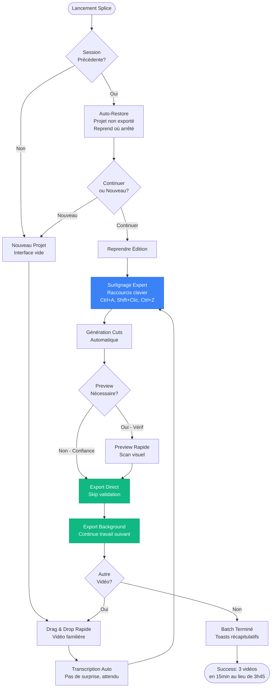

# UX Design Specification Splice

**Author:** Nicolas
**Date:** 2026-01-29

---

## Executive Summary

### Project Vision

Splice transforme le dérushage vidéo en remplaçant le scrubbing manuel chronophage (1h15 pour 1h de rushes) par un workflow textuel ultra-rapide (3-5 minutes). L'utilisateur importe sa vidéo, obtient un transcript instantané via transcription locale (Parakeet), surligne les passages à garder dans une interface familière type logiciel de montage, et obtient des cuts automatiques précis prêts à exporter.

**Innovation UX clé:** Introduire le paradigme textuel (curation par surlignage) dans une interface timeline familière aux monteurs professionnels, réduisant drastiquement la courbe d'apprentissage tout en offrant le contrôle frame-par-frame qu'ils attendent.

### Target Users

**Profil principal:** Monteurs vidéo professionnels et créateurs de contenu avec niveau technique élevé, habitués aux outils professionnels (Premiere Pro, DaVinci Resolve, CapCut). Utilisateurs exigeants qui connaissent leur métier et attendent une interface polie, rapide, et précise.

**Personas clés:**
1. **Orlan** - Monteur pro (15 vidéos/semaine, interviews longues, besoin massif de gain de temps)
2. **Nicolas** - Créateur tech solo (limité par temps de montage, veut tripler sa production)
3. **Sophie** - Podcasteuse gaming (sceptique mais convertie par la preuve de valeur)

**Caractéristiques comportementales:**
- Workflow séquentiel: Splice → Export → Import dans leur NLE principal
- Pensent en "frames", "secondes", "cuts", "timeline"
- Tolérance zéro pour bugs ou lenteur
- Apprécient les raccourcis clavier et navigation efficace
- Besoin de contrôle précis (ajustements frame par frame)

### Key Design Challenges

**Challenge 1: Hybridation paradigmes**
Créer une interface qui marie le paradigme textuel (surlignage de transcript) avec les patterns mentaux timeline des monteurs. L'utilisateur doit voir immédiatement "timeline en bas + texte à gauche" et comprendre instinctivement le lien entre les deux.

**Challenge 2: Balance rapidité / précision**
Le workflow principal doit être ultra-rapide (surlignage → cuts en 3min) MAIS offrir des outils d'ajustement précis frame par frame pour les 5% de cas nécessitant des retouches. Deux modes d'interaction: Quick (surlignage massif) et Precision (ajustement fin avec flèches clavier, marges personnalisées).

**Challenge 3: Feedback pour opérations longues**
Gros fichiers (15-50GB) créent de l'anxiété. Besoin de feedback rassurant et précis: barre de progression, pourcentage, estimation temps restant, possibilité d'annuler à tout moment. Gestion d'erreurs gracieuse avec retry facile si transcription échoue.

**Challenge 4: Moment de conversion freemium**
Créer une frustration calculée au moment optimal: après preview parfaite (utilisateur convaincu de la valeur) mais avant export (blocage total). Message doit transformer frustration en achat immédiat: "Vous venez de créer votre vidéo en 5min au lieu de 1h15. Débloquez l'export maintenant."

### Design Opportunities

**Opportunité 1: Exploitation patterns familiers**
Utiliser l'interface timeline que les monteurs connaissent par cœur (timeline en bas, contrôles lecture familiers, navigation clavier) pour créer un sentiment immédiat de familiarité. Réduction courbe d'apprentissage à quasi-zéro.

**Opportunité 2: Innovation dans la familiarité**
Introduire la "magie" (transcript instantané, cuts automatiques) dans un contexte visuel familier. La timeline devient synchronisée avec le texte surligné - pattern mental nouveau mais ancré dans leurs habitudes.

**Opportunité 3: Conversion par preuve irréfutable**
Le modèle freemium devient un démonstrateur de valeur: l'utilisateur voit sa vidéo parfaitement cutée en preview, calcule mentalement le temps gagné, puis se heurte au blocage export. Conversion naturelle car valeur déjà prouvée.

**Opportunité 4: Crédibilité professionnelle**
Offrir ajustements frame par frame, contrôle marges précis, export qualité préservée = signaux de crédibilité pour utilisateurs pros. Splice n'est pas un "jouet" mais un outil pro qui respecte leur expertise.

## Core User Experience

### Defining Experience

**L'action centrale:** Le cœur de Splice est le **surlignage intelligent de texte** dans le transcript. L'utilisateur lit le contenu parlé comme un article, surligne les passages à conserver, et le système traduit automatiquement ces sélections textuelles en cuts vidéo précis.

**Workflow en deux phases:**
1. **Phase rapide (80% du travail):** Surlignage massif en 2-3 minutes - l'utilisateur parcourt le transcript rapidement, sélectionne les blocs pertinents sans se soucier de la précision frame-par-frame
2. **Phase précision (20% optionnel):** Ajustements fins pour les passages critiques - navigation frame par frame avec flèches clavier, ajout/retrait de frames, contrôle marges avant/après

**L'interaction make-or-break:** La synchronisation temps réel entre texte surligné et timeline visuelle. Quand l'utilisateur surligne un mot, la timeline doit **immédiatement** refléter la sélection visuellement. C'est cette synchronisation instantanée qui crée le sentiment de contrôle et de magie.

### Platform Strategy

**Plateforme principale:** Application desktop native cross-platform (Tauri)
- macOS 13 Ventura+ (Intel et Apple Silicon)
- Windows 10 22H2+ / Windows 11

**Modalité d'interaction:** Clavier et souris principalement
- Raccourcis clavier pour productivité (espace pour play/pause, flèches pour navigation frame-par-frame, etc.)
- Drag & drop pour import fichiers
- Sélection texte à la souris ou trackpad

**Offline-first après installation:**
- Transcription 100% locale (Parakeet on-device)
- Fonctionnement complet sans connexion internet après téléchargement initial du modèle
- Grace period 7 jours pour vérification licence

**Considérations écran:**
- Optimisé pour écrans 15"+ (usage monteur typique)
- Support multi-écran post-MVP (détachement preview)
- Layout responsive pour s'adapter à 13" MacBook (minimum viable)

### Effortless Interactions

**Automatisations sans friction:**

1. **Transcription automatique** - Pas de bouton "Transcrire". Dès l'import validé, la transcription se lance automatiquement en arrière-plan
2. **Validation format silencieuse** - Détection codec/format au drop, rejet immédiat avec message clair si non supporté
3. **Synchronisation temps réel** - Texte surligné ↔ timeline visuellement synchronisés sans délai perceptible
4. **Auto-save transparent** - Sauvegarde automatique toutes les 30s sans interrompre le workflow
5. **Génération cuts en un clic** - Un seul bouton "Générer les cuts", pas de configuration complexe
6. **Preview intégrée** - Lecture vidéo cutée directement dans l'app, pas d'export temporaire nécessaire

**Réduction de friction:**
- Import par drag & drop (pas de file picker modal si possible)
- Raccourcis clavier standards NLE (espace = play/pause, J/K/L = scrub, etc.)
- Annulation possible pour toutes opérations longues (transcription, génération cuts, export)
- Retry automatique avec backoff pour échecs réseau (téléchargement Parakeet, vérification licence)

### Critical Success Moments

**Moment 1: Le "wow" initial (2s après import)**
L'utilisateur drop une vidéo de 60 minutes. Le transcript complet apparaît en 1-2 secondes. C'est le premier choc - "ça marche vraiment aussi vite?". Ce moment valide immédiatement la promesse de rapidité.

**Moment 2: La synchronisation magique (première sélection)**
L'utilisateur surligne son premier passage de texte. La timeline s'illumine instantanément pour montrer visuellement la sélection. Le lien texte ↔ vidéo devient évident. Pattern mental nouveau mais ancré dans familiarité timeline.

**Moment 3: La preview parfaite (validation qualité)**
Après génération des cuts, l'utilisateur appuie sur play dans la preview. Les transitions sont fluides, aucune coupe mid-word, les marges sont naturelles. Il réalise: "je n'ai pas besoin de retoucher dans Premiere". Confiance établie.

**Moment 4: Le blocage conversion (frustration → achat)**
L'utilisateur clique sur "Exporter". Écran de blocage: "Vous venez de créer en 5 minutes ce qui prend normalement 1h15. Débloquez l'export maintenant pour €X/mois." L'utilisateur a la vidéo cutée sous les yeux, a ressenti le gain de temps. Conversion naturelle.

**Moment 5: Le premier ajustement précis (crédibilité pro)**
L'utilisateur utilise les flèches pour ajuster un cut frame par frame. La réponse est instantanée, le contrôle est total. Signal de crédibilité: "ce n'est pas un jouet, c'est un outil pro qui respecte mon expertise".

### Experience Principles

**Principe 1: Familiarité Immédiate**
L'interface reprend les codes visuels des NLE professionnels (timeline en bas, contrôles lecture standard, terminologie métier). Un monteur qui ouvre Splice pour la première fois doit reconnaître instantanément les patterns qu'il utilise dans Premiere/DaVinci. Zéro courbe d'apprentissage pour la structure de base.

**Principe 2: Rapidité Viscérale**
La vitesse n'est pas qu'une métrique technique - elle doit être **ressentie**. Transcription en 1-2s (pas 5-10s), synchronisation temps réel (pas de délai perceptible), génération cuts en 10-30s. Chaque interaction doit renforcer le sentiment de "cet outil est magiquement rapide".

**Principe 3: Précision Professionnelle**
Interface "rapide par défaut, précise quand nécessaire". Le workflow principal favorise la vitesse (surlignage massif en 3min) MAIS le contrôle frame-par-frame est toujours accessible. Deux modes cohabitent: Quick Mode (80% des cas) et Precision Mode (20% des retouches). Respect de l'expertise des monteurs professionnels.

**Principe 4: Confiance par la Transparence**
Jamais de "boîte noire". Feedback clair à chaque étape: pourcentage précis, temps estimé affiché, possibilité d'annuler visible, retry facile en cas d'échec. L'utilisateur doit toujours savoir exactement ce qui se passe et avoir le contrôle.

**Principe 5: Conversion par la Preuve**
Le modèle freemium n'est pas une limitation frustrante - c'est un **démonstrateur de valeur**. L'utilisateur doit voir, toucher, valider la vidéo cutée parfaite AVANT de payer. Le blocage export arrive après que la valeur soit irréfutable. La conversion n'est pas une vente - c'est une conclusion logique.

## Desired Emotional Response

### Primary Emotional Goals

**Empowerment (Puissance récupérée)**
L'émotion centrale de Splice est le sentiment de **contrôle retrouvé** sur le temps et la productivité. Le monteur doit ressentir viscéralement "je viens de faire en 3 minutes ce qui me prenait 1h15". Ce n'est pas qu'un gain de temps technique - c'est une transformation de leur réalité professionnelle. Orlan qui récupère 3 jours complets en 2 semaines doit le **ressentir dans son corps**, pas juste le calculer intellectuellement.

**Surprise transformée en Confiance**
Le parcours émotionnel commence par le scepticisme ("encore un outil magique..."), passe par la surprise ("transcript en 2s, c'est réel??"), puis s'ancre dans la **confiance totale** ("je peux faire confiance à cet outil pour mon travail professionnel"). Cette transition scepticisme → surprise → confiance doit se dérouler en moins de 5 minutes lors de la première utilisation.

**Flow productif**
Pendant le workflow de surlignage, l'utilisateur doit entrer dans un état de **flow** - lecture rapide du transcript, sélection intuitive, zéro friction cognitive. Pas de pause pour réfléchir "comment je fais ça?". Tout est évident, naturel, fluide. L'utilisateur est absorbé dans la **curation du contenu**, pas dans l'apprentissage de l'interface.

**Accomplissement disproportionné**
À la fin du workflow (preview validée), l'utilisateur doit ressentir un **accomplissement disproportionné** par rapport au temps investi. "J'ai TERMINÉ en 5 minutes." Pas juste satisfaction ou soulagement - un vrai sentiment d'avoir été **extraordinairement productif**.

### Emotional Journey Mapping

**Phase 1: Découverte (avant premier lancement)**
- Scepticisme + Curiosité: "Encore un outil qui promet la lune..."
- Espoir prudent: "Si ça marche vraiment, ça change tout pour moi"
- Décision de tester: "Essai gratuit, je ne risque rien"

**Phase 2: Premier import (0-30s)**
- Anxiété légère: "Fichier 50GB, est-ce que ça va planter?"
- Réassurance progressive: Feedback clair, pourcentage précis, estimation temps
- Anticipation: "Voyons voir si c'est aussi rapide qu'annoncé"

**Phase 3: Le "wow" initial (transcript apparaît en 1-2s)**
- Surprise pure: "QUOI? 60 minutes transcrites en 2 secondes??"
- Validation immédiate: "C'est réel. Ça marche vraiment."
- Excitation croissante: "Si c'est aussi rapide pour le reste..."

**Phase 4: Workflow surlignage (2-5min)**
- Flow: Lecture rapide, surlignage intuitif, absorption dans le contenu
- Contrôle: Timeline synchronisée visuellement, lien texte-vidéo évident
- Confiance croissante: "C'est exactement ce dont j'avais besoin"

**Phase 5: Génération cuts + Preview (30s-2min)**
- Anticipation: "Est-ce que les cuts seront précis?"
- Validation qualité: "Aucune coupe mid-word, transitions naturelles"
- Accomplissement: "J'ai fini en 5 minutes ce qui prend normalement 1h15"

**Phase 6: Blocage export freemium (moment de conversion)**
- Frustration calculée: "Je veux exporter MAINTENANT"
- Réalisation valeur: "J'ai gagné 1h10. €15/mois c'est rien comparé à ça."
- Décision rationnelle: Conversion naturelle (valeur déjà prouvée)

**Phase 7: Utilisations futures (workflow établi)**
- Confiance établie: "Mon outil de dérushage quotidien"
- Routine productive: Pas de surprise, juste efficacité répétable
- Fidélité: Recommandation spontanée à d'autres monteurs

### Micro-Emotions

**Confiance vs Anxiété**
- **Objectif:** Réassurance constante, jamais d'anxiété paralysante
- **Moyens UX:** Feedback transparent (pourcentage précis, temps estimé), annulation toujours visible, retry facile en cas d'échec
- **Moments critiques:** Import gros fichiers, transcription longue, génération cuts, export final

**Contrôle vs Impuissance**
- **Objectif:** Utilisateur toujours en contrôle, jamais de "l'outil a décidé pour moi"
- **Moyens UX:** Ajustements frame par frame disponibles, marges personnalisables (post-MVP), annulation opérations, preview avant export
- **Moments critiques:** Sélection passages, validation cuts, décision export

**Delight vs Simple Satisfaction**
- **Objectif:** Surprise positive répétée (pas juste fonctionnalité attendue)
- **Moyens UX:** Vitesse viscérale (transcript 1-2s), synchronisation instantanée texte-timeline, animations subtiles
- **Moments critiques:** Première transcription, première sélection texte, preview cuts parfaits

**Accomplissement vs Soulagement**
- **Objectif:** "J'ai été extraordinairement productif" (pas juste "ouf, c'est fini")
- **Moyens UX:** Feedback temps gagné visible, workflow court (5min max), validation claire (preview parfaite)
- **Moments critiques:** Fin workflow surlignage, preview validée, export terminé

**Familiarité vs Désorientation**
- **Objectif:** Reconnaissance immédiate patterns NLE, zéro courbe d'apprentissage structure
- **Moyens UX:** Timeline en bas, contrôles lecture standards, terminologie métier, raccourcis clavier familiers
- **Moments critiques:** Premier lancement, découverte interface, premiers raccourcis

**Efficacité vs Friction**
- **Objectif:** Flow continu, zéro interruption cognitive
- **Moyens UX:** Auto-save silencieux, pas de modals intrusifs, transcription automatique au drop, génération cuts en un clic
- **Moments critiques:** Tout le workflow principal (import → export)

### Design Implications

**Pour créer l'Empowerment:**
1. Afficher feedback temps gagné visible: "Vous avez traité 60min de vidéo en 4min37s"
2. Message conversion mentionne comparaison: "Normalement 1h15, vous avez fait en 5min"
3. Contrôle total sur cuts: ajustements frame par frame toujours accessibles
4. Export qualité préservée: signal de respect pour expertise pro

**Pour créer la Confiance:**
1. Preview obligatoire avant export: utilisateur valide toujours le résultat
2. Feedback transparent: pourcentages précis, temps estimé honnête (pas optimiste)
3. Retry facile en cas d'échec: pas de blocage permanent, messages actionnables
4. Auto-save + crash recovery: pas de perte de travail jamais
5. Qualité export garantie: compatible Premiere/DaVinci sans post-traitement

**Pour créer le Flow:**
1. Zéro modal intrusif pendant workflow principal
2. Auto-save silencieux toutes les 30s (pas de "Voulez-vous sauvegarder?")
3. Raccourcis clavier standards NLE (espace, J/K/L, flèches) pour muscle memory
4. Synchronisation temps réel texte-timeline sans délai perceptible
5. Transcription automatique au drop (pas de bouton "Transcrire")

**Pour créer le Delight:**
1. Vitesse viscérale: transcript 1-2s (pas 5-10s), cuts 10-30s (pas minutes)
2. Animations subtiles synchronisation texte-timeline (feedback visuel immédiat)
3. Sound design discret pour actions réussies: transcription terminée, cuts générés (optionnel, à tester)
4. Premier wow répétable: chaque nouvelle vidéo = même surprise de vitesse

**Pour éviter l'Anxiété:**
1. Annulation toujours visible pour opérations longues (transcription, cuts, export)
2. Estimation temps restant affichée (même approximative > rien)
3. Messages d'erreur clairs et actionnables (pas de stack traces, pas de jargon)
4. Validation format/codec immédiate au drop (rejet clair si non supporté)
5. Grace period licence 7 jours (pas de blocage brutal offline)

**Pour créer l'Accomplissement:**
1. Moment validation clair: preview parfaite = "vous avez réussi"
2. Workflow court: 5min max pour 1h de vidéo (promesse tenue)
3. Export rapide: max 2x durée vidéo finale (pas d'attente frustrante)
4. Fichier prêt à l'emploi: import direct Premiere/DaVinci sans conversion

### Emotional Design Principles

**Principe 1: Réassurance Permanente**
L'utilisateur ne doit jamais se sentir abandonné ou dans le noir. Chaque opération longue affiche feedback précis (pourcentage, temps estimé). Chaque erreur propose une solution claire. Chaque action critique (export) demande confirmation. La confiance se construit par la **transparence totale**.

**Principe 2: Empowerment par le Contrôle**
L'utilisateur doit toujours sentir qu'il a le pouvoir de décision. Preview avant export (pas d'export surprise), annulation disponible (pas d'opération forcée), ajustements précis accessibles (pas de "l'outil sait mieux"). Le contrôle = respect de l'expertise professionnelle.

**Principe 3: Delight par la Vitesse Viscérale**
La rapidité n'est pas qu'une métrique - c'est une **émotion ressentie**. Transcript en 1-2s crée un choc positif répétable. Synchronisation instantanée texte-timeline crée un sentiment de magie. Chaque interaction rapide renforce "cet outil est différent".

**Principe 4: Flow par l'Automatisation Invisible**
Les actions évidentes doivent être automatiques: transcription au drop, auto-save silencieux, validation format immédiate. L'utilisateur reste concentré sur sa **tâche créative** (curation du contenu), pas sur la manipulation de l'outil.

**Principe 5: Conversion par Preuve Émotionnelle**
Le blocage freemium n'arrive qu'après que l'utilisateur ait **ressenti** la valeur: vitesse vécue, preview parfaite validée, temps gagné calculé mentalement. La conversion n'est pas une vente agressive - c'est la conclusion logique d'une démonstration émotionnelle.

## UX Pattern Analysis & Inspiration

### Inspiring Products Analysis

**Professional NLE (Premiere Pro, DaVinci Resolve, CapCut)**

**Forces UX:**
- Timeline visuelle universelle: pattern mental ancré chez tous les monteurs, reconnaissance immédiate
- Raccourcis clavier standardisés: muscle memory préservée (espace = play/pause, J/K/L = scrub, flèches = frame-by-frame)
- Contrôle précis: ajustements frame par frame, marqueurs in/out, zoom timeline
- Presets réutilisables: configurations sauvegardées pour workflows répétitifs

**Leçons pour Splice:**
L'interface timeline n'est pas à réinventer - elle est **parfaite** pour ce qu'elle fait. Splice doit l'adopter intégralement pour exploiter la familiarité existante. L'innovation vient du paradigme textuel synchronisé avec cette timeline, pas de la timeline elle-même.

**Descript (édition vidéo via transcription)**

**Forces UX:**
- Synchronisation texte-vidéo bidirectionnelle: clic sur mot = jump to timestamp, édition texte = édition vidéo
- Transcription automatique rapide: pas de friction entre import et édition
- Édition textuelle familière: tout le monde sait éditer du texte

**Leçons pour Splice:**
Descript prouve que le paradigme textuel fonctionne pour la vidéo. MAIS leur focus est l'édition granulaire (supprimer mots, réorganiser phrases). Splice se différencie par la **curation rapide** (surligner massivement passages à garder) plutôt que l'édition fine. Le pattern de synchronisation est transférable, l'usage est différent.

**Applications rapides (Linear, Raycast, Superhuman)**

**Forces UX:**
- Vitesse viscérale: chaque interaction <100ms, sentiment de réponse instantanée
- Feedback visuel immédiat: animations subtiles confirment chaque action
- Raccourcis omniprésents: navigation complète au clavier sans souris
- Pas de friction: auto-save, pas de modals, workflow continu

**Leçons pour Splice:**
La rapidité doit être **ressentie**, pas juste mesurée. Synchronisation texte-timeline doit être temps réel (<16ms). Auto-save silencieux. Raccourcis clavier pour power users. Chaque interaction renforce "cet outil est rapide".

### Transferable UX Patterns

**Navigation Patterns:**

1. **Timeline universelle** (de tous les NLE)
   - Pattern: Représentation visuelle horizontale du temps, segments colorés, scrubbing direct
   - Transfert Splice: Timeline en bas montre sélections textuelles comme segments vidéo, synchronisation bidirectionnelle
   - Bénéfice: Reconnaissance immédiate, zéro courbe d'apprentissage structure

2. **Raccourcis clavier standards** (de Premiere/DaVinci)
   - Pattern: Espace (play/pause), J/K/L (scrub), Flèches (frame-by-frame), I/O (in/out)
   - Transfert Splice: Même mapping pour preview, navigation transcript au clavier, sélection rapide
   - Bénéfice: Muscle memory préservée, productivité immédiate

**Interaction Patterns:**

1. **Synchronisation bidirectionnelle** (de Descript)
   - Pattern: Clic texte → jump vidéo, édition texte → édition vidéo
   - Transfert Splice: Surlignage texte → sélection timeline, hover texte → preview position
   - Bénéfice: Bridge naturel entre paradigme textuel et visuel

2. **Feedback instantané** (de apps rapides)
   - Pattern: Réponse visuelle <100ms, animations subtiles, pas de délai perceptible
   - Transfert Splice: Synchronisation temps réel texte-timeline, preview seek instantané
   - Bénéfice: Sentiment de contrôle direct, flow non interrompu

3. **Drag & drop universel** (pattern OS)
   - Pattern: Déposer fichier = import immédiat, validation visuelle claire
   - Transfert Splice: Drop vidéo → transcription auto, validation format immédiate
   - Bénéfice: Friction minimale, workflow naturel

**Visual Patterns:**

1. **Segmentation colorée** (de timelines NLE)
   - Pattern: Segments visuellement distincts, couleurs pour catégories
   - Transfert Splice: Passages surlignés = segments verts sur timeline, non-surlignés = gris
   - Bénéfice: Compréhension visuelle immédiate de la sélection

2. **Progression transparente** (de apps modernes)
   - Pattern: Barre de progression, pourcentage précis, temps estimé, annulation visible
   - Transfert Splice: Transcription, génération cuts, export avec feedback complet
   - Bénéfice: Réassurance, confiance, contrôle

### Anti-Patterns to Avoid

**1. Import complexe et opaque**
- **Problème observé:** File pickers lents, formats supportés non documentés, crashes sur gros fichiers sans warning
- **Impact:** Anxiété utilisateur, abandons précoces, première impression négative
- **Solution Splice:** Drag & drop direct, validation format immédiate avec message clair, architecture streaming pour 50GB

**2. Feedback vague ou mensonger**
- **Problème observé:** "Processing..." indéfini, estimations temps optimistes (5min → 30min réel), pas d'annulation
- **Impact:** Frustration, perte de confiance, anxiété ("est-ce que ça a planté?")
- **Solution Splice:** Pourcentage précis, estimation temps honnête, annulation toujours disponible

**3. Perte de travail**
- **Problème observé:** Crashes perdent session, "Voulez-vous sauvegarder?" oubliable, pas de recovery
- **Impact:** Rage quit, perte confiance totale, abandon outil
- **Solution Splice:** Auto-save silencieux 30s, crash recovery automatique au redémarrage

**4. Innovation déroutante**
- **Problème observé:** Interface "révolutionnaire" mais non-standard, patterns inventés, terminologie nouvelle
- **Impact:** Courbe d'apprentissage inutile, friction cognitive, rejet par pros
- **Solution Splice:** Timeline familière, raccourcis standards, terminologie NLE connue. L'innovation (paradigme textuel) vient **dans** la familiarité, pas **contre** elle.

**5. Feature bloat prématuré**
- **Problème observé:** Options partout, menus profonds, features avancées en avant, complexité imposée
- **Impact:** Paralysie décisionnelle, workflow ralenti, sentiment "trop compliqué pour moi"
- **Solution Splice:** Workflow principal ultra-simple (surlignage → cuts), features avancées accessibles mais pas imposées (ajustements précis disponibles, pas obligatoires)

### Design Inspiration Strategy

**What to Adopt (utiliser tel quel):**

1. **Timeline visuelle en bas** - Pattern NLE universel, reconnaissance immédiate, zéro courbe d'apprentissage
2. **Raccourcis clavier standards** - Espace, J/K/L, flèches = muscle memory préservée
3. **Feedback transparent** - Pourcentages précis, temps estimé honnête, annulation visible = confiance
4. **Drag & drop import** - Pattern OS universel, friction minimale

**What to Adapt (modifier pour Splice):**

1. **Synchronisation texte-vidéo** (inspiré Descript) - Adapté pour curation massive (surlignage rapide) plutôt qu'édition granulaire
2. **Auto-save silencieux** (pattern apps modernes) - Appliqué au contexte montage vidéo (sauvegarde projet toutes les 30s)
3. **Vitesse viscérale** (apps rapides) - Appliqué à transcription ML (1-2s pour 60min) et synchronisation temps réel
4. **Presets réutilisables** (NLE pros) - Post-MVP: marges personnalisées, patterns sélection courants

**What to Avoid (rejeter explicitement):**

1. **Import complexe** - Pas de file picker lent, pas de formats obscurs, pas de crash gros fichiers
2. **Feedback vague** - Jamais de "Processing..." indéfini, jamais d'estimations optimistes mensongères
3. **Perte de travail** - Jamais de session perdue, jamais de "oups j'ai oublié de sauvegarder"
4. **Interface non-standard** - Pas d'innovation gratuite qui désoriente les pros
5. **Complexité prématurée** - MVP simple, features avancées post-MVP uniquement

**Guiding Principle:**
L'innovation de Splice (paradigme textuel pour curation vidéo) doit vivre **à l'intérieur** d'une interface familière (timeline NLE), pas **à la place**. Les monteurs doivent dire "c'est comme Premiere, mais avec de la magie textuelle" - pas "c'est un outil bizarre qui fait du montage différemment".

## Design System Foundation

### Design System Choice

**Choix: Tailwind CSS + Shadcn/ui**

Splice utilisera une approche hybride combinant flexibilité et rapidité de développement:
- **Tailwind CSS** comme foundation utility-first pour styling custom
- **Shadcn/ui** pour composants UI standards (boutons, modals, inputs, progress bars)
- **Custom components** en Tailwind pur pour interfaces spécifiques NLE (timeline, transcript editor)

Cette stack moderne offre le meilleur équilibre entre rapidité de développement (composants prêts) et flexibilité totale (design custom) pour une application desktop professionnelle.

### Rationale for Selection

**Vitesse de développement:**
Solo développeur avec timeline MVP 2-4 mois. Shadcn/ui fournit composants standards prêts à l'emploi (boutons, modals, inputs, progress bars) = gain de temps significatif. Pas besoin de réinventer les roues pour UI basique.

**Flexibilité maximale pour composants critiques:**
L'interface centrale de Splice (timeline NLE-like + transcript editor synchronisé) est unique et ne peut pas utiliser de composants génériques. Tailwind permet de construire ces interfaces custom avec contrôle pixel-perfect et performance optimale.

**Look professionnel NLE:**
Shadcn/ui est headless (basé Radix UI) = pas de style imposé type "Material Design" ou "Bootstrap". Contrôle total sur l'apparence pour créer un look professionnel cohérent avec outils NLE (Premiere, DaVinci) plutôt qu'une "web app générique".

**Expertise existante:**
Stack déjà maîtrisée (Tailwind + Shadcn/ui) = zéro courbe d'apprentissage, productivité immédiate, focus sur fonctionnalités plutôt qu'apprentissage framework.

**Performance desktop:**
Tailwind génère CSS optimisé minimal. Radix UI (base de Shadcn/ui) = composants React légers et accessibles. Parfait pour application desktop Tauri nécessitant réactivité et fluidité.

**Accessibilité built-in:**
Radix UI fournit accessibilité clavier et ARIA par défaut = navigation clavier professionnelle (critique pour monteurs power users) sans effort supplémentaire.

### Implementation Approach

**Phase 1: Setup et Configuration**
1. Installer Tailwind CSS dans le frontend web du projet Tauri
2. Intégrer Shadcn/ui avec configuration custom theme
3. Définir palette couleurs (dark mode probable pour outil pro)
4. Configurer design tokens (spacing, typography, colors, shadows)

**Phase 2: Composants Standards (Shadcn/ui)**
Installer et customiser les composants Shadcn/ui nécessaires au MVP:
- **Button** - Actions principales (Générer cuts, Exporter, Annuler)
- **Dialog/Modal** - Messages erreur, confirmation export, blocage freemium
- **Progress** - Transcription, génération cuts, export (avec % et temps estimé)
- **Input** - Formulaires si nécessaire (licence, settings post-MVP)
- **Toast** - Notifications success/error discrètes
- **Tooltip** - Explications raccourcis clavier
- **DropZone** (ou custom) - Import vidéo drag & drop

**Phase 3: Composants Custom (Tailwind)**
Construire from scratch les interfaces uniques à Splice:
- **Timeline Component** - Représentation visuelle NLE-like avec segments sélections, scrubbing, synchronisation texte
- **Transcript Editor** - Éditeur texte avec surlignage, word-level highlighting, sync vidéo
- **Video Preview Player** - Lecteur vidéo intégré avec contrôles NLE standards (play/pause, scrub, frame-by-frame)
- **Sync Indicators** - Visuels montrant lien texte ↔ timeline (highlight, animations subtiles)

**Phase 4: Theming et Polish**
- Définir thème cohérent (probablement dark mode pour monteurs pros)
- Affiner animations synchronisation (subtiles, <16ms, renforce rapidité viscérale)
- Tester accessibilité clavier complète (espace, J/K/L, flèches)
- Optimiser performance (lazy loading, virtualization si nécessaire pour longs transcripts)

### Customization Strategy

**Adaptation Shadcn/ui au look NLE professionnel:**

1. **Palette couleurs:**
   - Probablement dark mode par défaut (standard outils pros montage)
   - Couleurs primaires cohérentes avec brand Splice (à définir)
   - Contraste élevé pour lisibilité transcript
   - États hover/active discrets mais clairs

2. **Typography:**
   - Système lisible pour transcript (font-size confortable lecture rapide)
   - Monospace partiel pour timestamps dans transcript?
   - Hiérarchie claire (titres, body, captions)

3. **Borders et Radius:**
   - NLE ont tendance à être "sharper" que web apps consumer
   - Réduire border-radius par défaut Shadcn/ui pour look plus pro?
   - Borders subtils pour délimitation zones (transcript / timeline / preview)

4. **Animations:**
   - Synchronisation texte-timeline: instantanée (<16ms) avec feedback visuel subtil
   - Transitions modals/toasts: rapides (150-200ms) pas lentes (300ms+)
   - Feedback actions: confirmation visuelle immédiate (progress bars, state changes)

5. **Layout responsif:**
   - Optimisé pour écrans 15"+ (usage monteur typique)
   - Support minimum 13" MacBook (layout adaptatif)
   - Focus desktop, pas mobile (hors scope MVP)

**Composants custom alignés avec patterns NLE:**
- Timeline utilise codes couleurs familiers (vert = sélectionné, gris = non-sélectionné)
- Contrôles vidéo reprennent iconographie standard NLE (triangles play, carrés stop, etc.)
- Raccourcis clavier mappés standards Premiere/DaVinci (espace, J/K/L, flèches)
- Terminologie interface cohérente avec NLE (In/Out points, Timeline, Playhead, etc.)

## Core User Experience Definition

### Defining Experience

**L'interaction centrale: "Surligner du texte pour garder ces passages dans la vidéo finale"**

Splice se définit par une seule interaction centrale: l'utilisateur lit le transcript comme un article, surligne les passages à conserver, et le système traduit automatiquement ces sélections textuelles en segments vidéo à garder. Cette interaction, si parfaitement exécutée, rend tout le reste du produit évident et naturel.

**Ce que les utilisateurs diront:**
"Tu lis le transcript comme un article, tu surligne ce que tu veux garder, et ça génère les cuts automatiquement. J'ai fait 1h de rushes en 4 minutes."

**Pourquoi c'est l'expérience centrale:**
- **Simple à expliquer:** Une phrase suffit pour comprendre le concept
- **Intuitive:** Tout le monde sait surligner du texte
- **Magique:** La synchronisation texte → vidéo crée le moment "wow"
- **Différenciante:** Aucun concurrent ne propose cette approche de curation massive

Si le surlignage est fluide, la synchronisation instantanée, et le résultat précis → Splice réussit. Si c'est laggy, confus, ou imprécis → Splice échoue, peu importe les autres features.

### User Mental Model

**Modèle mental existant (ce que les utilisateurs connaissent):**

1. **Lecture de texte:** Les monteurs savent lire rapidement du texte (scripts, notes, sous-titres). Pattern ultra-familier.
2. **Surlignage:** Tout le monde surligne des passages importants dans des documents (PDF, articles, notes). Geste naturel.
3. **Timeline NLE:** Les monteurs pensent en "timeline horizontale" avec segments visuels. Pattern ancré depuis des années.

**Modèle mental nouveau (ce qu'on introduit):**

4. **Synchronisation bidirectionnelle:** Le lien texte ↔ timeline est nouveau pour la curation vidéo. Surligner texte = sélectionner segment vidéo. Ce pattern doit être **évident visuellement** sans explication verbale.

**Apprentissage intuitif:**
Le pattern novel (synchronisation) est appris par l'**affordance visuelle** immédiate: dès que l'utilisateur surligne le premier mot, la timeline s'illumine instantanément au même endroit. Le lien devient évident sans tutorial. "Ah, le texte et la timeline sont connectés."

**Mental model résultant:**
Après 30 secondes d'utilisation, l'utilisateur pense: "Le texte, c'est ma vidéo. Surligner, c'est garder. La timeline me montre ce que j'ai sélectionné." C'est simple, visuel, immédiat.

### Success Criteria

**L'interaction est réussie quand:**

1. **Vitesse perçue instantanée (<16ms):**
   - Surlignage texte → timeline update sans délai perceptible
   - Aucun lag entre action et feedback visuel
   - Sentiment de "réponse immédiate" = contrôle direct

2. **Feedback visuel clair et évident:**
   - Texte surligné = couleur distinctive (vert?)
   - Timeline segments sélectionnés = même couleur (vert)
   - Non-sélectionné = gris/neutre
   - Impossible de se tromper sur "qu'est-ce qui est sélectionné?"

3. **Synchronisation précise:**
   - Texte surligné correspond exactement aux segments timeline
   - Pas de décalage visuel
   - Hover texte = preview position timeline (optionnel mais renforce lien)

4. **Fluidité du geste:**
   - Surlignage massif rapide (80% du transcript en 2-3min)
   - Pas de ralentissement avec gros transcripts (60min+)
   - Sélection/dé-sélection intuitive

5. **Feedback durée totale:**
   - Compteur visible: "32min15s sélectionnés sur 60min00s"
   - Utilisateur sait toujours combien il a sélectionné
   - Aide à calibrer (trop? pas assez?)

**Indicateurs d'échec (ce qui tuerait l'expérience):**
- Lag >100ms entre surlignage et timeline update
- Confusion sur "qu'est-ce qui est sélectionné?"
- Synchronisation imprécise (texte ≠ timeline)
- Lenteur avec longs transcripts

### Novel UX Patterns

**Patterns établis (on adopte):**

1. **Surlignage de texte:** Pattern universel, zéro apprentissage. Utilisé dans Google Docs, PDF readers, navigateurs, notes apps.
2. **Timeline horizontale:** Pattern NLE universel, ancré chez monteurs. Utilisé dans Premiere, DaVinci, Final Cut, CapCut.
3. **Segmentation colorée:** Segments visuels distincts sur timeline = pattern standard NLE.

**Pattern novel (on innove):**

**Synchronisation bidirectionnelle texte ↔ timeline pour curation:**
- **Nouveau:** Aucun NLE ne permet de "surligner du texte pour sélectionner vidéo"
- **Descript fait édition granulaire** (supprimer mots), pas curation massive
- **Splice fait curation rapide** (garder blocs entiers en 2-3min)

**Comment on enseigne ce pattern novel:**

1. **Affordance visuelle immédiate:** Dès le premier surlignage, timeline s'illumine au même endroit. Lien évident sans mots.
2. **Tooltip subtil (premier lancement):** Message discret "Surlignez le texte pour sélectionner les passages à garder" puis disparaît après première interaction.
3. **Feedback renforcé:** Animations subtiles lors synchronisation (pulse léger? highlight temporaire?) renforcent le lien mental.

**Notre twist unique:**
On combine pattern familier (timeline) + pattern familier (surlignage) dans un usage nouveau (curation vidéo massive). L'innovation vit **à l'intérieur** de la familiarité.

### Experience Mechanics

**Flow détaillé de l'interaction centrale:**

#### 1. Initiation

**Trigger:**
- Vidéo importée (drag & drop)
- Transcription terminée (1-2s)
- Interface principale s'affiche

**État initial:**
- **Transcript (gauche):** Texte complet visible, rien de surligné, scrollable
- **Timeline (bas):** Toute la vidéo en gris (= non-sélectionné par défaut)
- **Preview (droite ou centre):** Vidéo à la première frame, contrôles play/pause
- **Message d'invitation:** Tooltip subtil "Surlignez le texte pour sélectionner les passages à garder" (disparaît après première interaction)

**Affordance:**
- Curseur texte devient sélectionnable (cursor: text)
- Timeline inactive visuellement (gris neutre)

#### 2. Interaction

**Action utilisateur:**
- Utilisateur clique-glisse souris sur texte (surlignage classique)
- Ou utilise raccourcis clavier pour sélectionner (shift + flèches)

**Réponse système (temps réel <16ms):**
- Texte surligné devient **vert** (ou couleur principale brand)
- Timeline montre **segment correspondant en vert** simultanément
- Animation subtile (pulse léger?) renforce synchronisation
- Compteur durée update: "0min32s sélectionnés sur 60min00s"

**Continuation:**
- Utilisateur surligne d'autres passages
- Chaque nouveau passage = nouveau segment vert sur timeline
- Passages multiples = segments multiples (discontinus OK)
- Dé-sélection: clic sur texte surligné = retire sélection, segment timeline redevient gris

**Interactions secondaires:**
- **Hover texte:** Timeline montre position correspondante (ligne verticale légère?)
- **Clic texte non-surligné:** Jump to timestamp dans preview (feedback exploration)
- **Scroll transcript:** Timeline reste synchronisée (indicateur viewport visible sur timeline?)

#### 3. Feedback

**Feedback visuel primaire:**
- Texte surligné = **vert clair** (lisible, clairement distinct du non-surligné)
- Timeline segments = **vert foncé** (même palette, visuellement cohérent)
- Non-sélectionné = **gris neutre** (effacé, clairement "pas gardé")

**Feedback informationnel:**
- **Compteur durée:** "32min15s sélectionnés sur 60min00s" (visible en permanence)
- **Pourcentage optionnel:** "54% de la vidéo sélectionné"
- **Nombre de segments:** "12 segments sélectionnés" (utile pour comprendre fragmentation?)

**Feedback d'erreur:**
- Aucune sélection: Bouton "Générer les cuts" désactivé (grisé) avec tooltip "Surlignez au moins un passage"
- Sélection complète (100%): Message info "Toute la vidéo est sélectionnée" (utilisateur a peut-être inversé sa logique?)

**Feedback de contrôle:**
- Annulation: Ctrl+Z déselectionne dernier passage
- Tout sélectionner: Ctrl+A surligne tout (raccourci standard)
- Tout désélectionner: Bouton "Clear selection" visible

#### 4. Completion

**Critère de complétion:**
- Utilisateur a surligné tous les passages désirés
- Compteur durée finale satisfaisante
- Bouton "Générer les cuts" activé et visible

**Action finale:**
- Utilisateur clique "Générer les cuts"
- Transition vers étape suivante (génération cuts + preview)

**État de sortie:**
- Sélections sauvegardées automatiquement (auto-save)
- Possibilité de revenir modifier sélections après preview
- Workflow continu sans blocage

**Moment de succès:**
L'utilisateur réalise: "J'ai parcouru 60 minutes de contenu et sélectionné les passages clés en 3 minutes. C'est fait." Sentiment d'accomplissement disproportionné par rapport au temps investi.

## Visual Design Foundation

### Color System

**Theme Strategy: Dark Mode par Défaut**

Splice adopte un thème sombre (dark mode) comme configuration par défaut, aligné avec les outils professionnels de montage vidéo (Premiere Pro, DaVinci Resolve, Final Cut Pro). Ce choix réduit la fatigue visuelle lors de sessions de travail longues et met en avant le contenu (transcript, timeline, preview vidéo) plutôt que l'interface elle-même.

**Palette Principale:**

**Brand Primary - Vert Moderne:**
- **Primary Green:** `#10b981` (Emerald 500 - type Tailwind)
- **Usage:** Segments sélectionnés sur timeline, texte surligné, boutons actions principales
- **Connotation:** "Validation", "Go", "Gardé" - sentiment positif universel
- **Contraste:** Excellent contraste sur fond sombre, visible instantanément

**Neutrals - Échelle de Gris:**
- **Background:** `#0a0a0a` (Noir profond, quasi noir pur)
- **Surface:** `#171717` (Gris très sombre pour panels, cards)
- **Border:** `#262626` (Gris sombre pour délimitations subtiles)
- **Text Primary:** `#fafafa` (Blanc cassé pour texte principal)
- **Text Secondary:** `#a3a3a3` (Gris moyen pour texte secondaire)
- **Text Disabled:** `#525252` (Gris sombre pour états désactivés)

**Semantic Colors:**
- **Success:** `#10b981` (Vert primary - réutilisé)
- **Warning:** `#f59e0b` (Orange/Amber pour avertissements)
- **Error:** `#ef4444` (Rouge pour erreurs critiques)
- **Info:** `#3b82f6` (Bleu pour informations neutres)

**Functional Colors:**
- **Selected:** `#10b981` (Vert - segments timeline sélectionnés)
- **Unselected:** `#404040` (Gris neutre - segments non-sélectionnés)
- **Hover:** `#14b8a6` (Teal léger - états hover interactifs)
- **Focus:** `#3b82f6` (Bleu - focus clavier pour accessibilité)

**Accessibility Compliance:**
- Tous les ratios de contraste texte/fond respectent WCAG AA minimum (4.5:1 pour texte normal, 3:1 pour texte large)
- Vert primary `#10b981` sur fond sombre `#0a0a0a` = contraste >7:1 (AAA)
- Texte primary `#fafafa` sur fond `#0a0a0a` = contraste >21:1 (AAA)

### Typography System

**Typeface Strategy:**

**Primary Font - Inter (ou System UI fallback):**
- **Rationale:** Inter est optimisé pour lisibilité écran, moderne, clean, excellent hinting. Alternatives system UI (San Francisco sur macOS, Segoe UI sur Windows) garantissent performance native.
- **Usage:** Transcript, UI labels, boutons, tous textes interface
- **Weights:** Regular (400), Medium (500), Semibold (600) pour hiérarchie

**Monospace Font - JetBrains Mono (optionnel pour timestamps):**
- **Rationale:** Si on affiche timestamps dans transcript (ex: `[00:32:15]`), monospace améliore scan visuel
- **Usage:** Timestamps uniquement
- **Weight:** Regular (400)

**Type Scale:**

Basé sur échelle modulaire 1.25 (Major Third) avec base 16px:

- **H1 (Titres principaux):** 32px / 2rem - Line height 1.2 - Weight 600
- **H2 (Sous-titres):** 24px / 1.5rem - Line height 1.3 - Weight 600
- **H3 (Sections):** 20px / 1.25rem - Line height 1.4 - Weight 600
- **Body (Transcript, texte principal):** 16px / 1rem - Line height 1.6 - Weight 400
- **Body Small (Labels, captions):** 14px / 0.875rem - Line height 1.5 - Weight 400
- **Caption (Timestamps, metadata):** 12px / 0.75rem - Line height 1.4 - Weight 400

**Transcript-Specific Settings:**
- **Font-size:** 16px (confortable pour lecture longue)
- **Line-height:** 1.7 (aéré, facilite scan visuel)
- **Letter-spacing:** 0.01em (légèrement espacé pour clarté)
- **Max-width:** 65-75 caractères par ligne (optimal pour lisibilité)

**Hierarchy Principles:**
- Titres utilisent weights plus lourds (600) pour différenciation claire
- Body text reste Regular (400) pour lecture confortable
- Pas d'italique dans transcript (préserve lisibilité)
- Couleurs texte suivent échelle neutrals (Primary/Secondary/Disabled)

### Spacing & Layout Foundation

**Spacing Unit System:**

**Base unit: 4px (0.25rem)**

Échelle Tailwind standard pour cohérence:
- **0.5** = 2px (bordures ultra-fines)
- **1** = 4px (espaces minimaux)
- **2** = 8px (espaces serrés)
- **3** = 12px (espaces standards petits)
- **4** = 16px (espaces standards moyens)
- **6** = 24px (espaces standards larges)
- **8** = 32px (espaces sections)
- **12** = 48px (espaces majeurs)
- **16** = 64px (marges layout)

**Layout Strategy: Compact mais Organisé**

**Rationale:** Splice doit afficher simultanément transcript (gauche), timeline (bas), preview (centre/droite). Maximiser l'espace utile pour contenu, minimiser le chrome UI inutile.

**Grid System:**
- **Layout principal:** CSS Grid 3-zones
  - Zone gauche: Transcript (30-35% largeur)
  - Zone centre/droite: Preview vidéo (40-45% largeur)
  - Zone bas: Timeline (hauteur fixe 120-150px)
- **Responsive breakpoints:**
  - 13" MacBook (1440x900): Layout compact, preview réduit
  - 15"+ (1920x1080+): Layout optimal, tous éléments confortables

**Component Spacing:**
- **Internal padding (buttons, inputs):** px-4 py-2 (16px horizontal, 8px vertical)
- **Card/Panel padding:** p-4 ou p-6 (16px ou 24px selon densité)
- **Section spacing:** mb-8 ou mb-12 (32px ou 48px entre sections majeures)
- **Element spacing:** gap-2 ou gap-4 (8px ou 16px entre éléments groupés)

**Density Principles:**
1. **Maximize content area:** Transcript, timeline, preview occupent 90%+ de viewport
2. **Minimize chrome:** Toolbars, headers compacts (40-48px hauteur)
3. **Breathable groups:** Espaces suffisants entre groupes fonctionnels distincts
4. **Dense within groups:** Éléments liés restent proches (ex: transcript lines serrées mais lisibles)

**Layout Zones:**
```
┌─────────────────────────────────────────┐
│ Header (compact, 48px)                  │
├──────────────┬──────────────────────────┤
│              │                          │
│  Transcript  │      Video Preview       │
│  (30-35%)    │      (40-45%)           │
│              │                          │
│              │                          │
├──────────────┴──────────────────────────┤
│  Timeline (120-150px hauteur)           │
└─────────────────────────────────────────┘
```

**Borders & Dividers:**
- **Border width:** 1px standard
- **Border color:** `#262626` (subtil, délimite sans agressivité)
- **Border radius:** 4px ou 6px (légèrement arrondi, pas trop "web app")
- **Timeline/Preview:** Sharp corners (0px radius) pour look NLE pro

### Accessibility Considerations

**Contrast Compliance:**
- Tous les textes respectent WCAG AA minimum (4.5:1)
- Texte principal sur fond sombre: contraste >21:1 (AAA)
- Couleur primary (vert) sur fond sombre: contraste >7:1 (AAA)
- États interactifs (hover, focus) maintiennent contraste suffisant

**Keyboard Navigation:**
- **Focus visible:** Outline bleu `#3b82f6` avec 2px offset pour clarté
- **Tab order logique:** Transcript → Boutons actions → Timeline → Preview controls
- **Raccourcis clavier:** Documentés et standards NLE (espace, J/K/L, flèches)
- **Skip links:** Permettre de sauter entre zones principales (transcript, timeline, preview)

**Screen Reader Support:**
- Composants Radix UI (via Shadcn/ui) fournissent ARIA par défaut
- Labels clairs pour tous contrôles interactifs
- Status updates annoncés (ex: "Transcription terminée", "Cuts générés")
- Timeline segments ont labels textuels (pas que visuels)

**Motion & Animations:**
- **Respect prefers-reduced-motion:** Désactiver animations non-essentielles si préférence système
- **Animations essentielles maintenues:** Synchronisation texte-timeline (feedback critique)
- **Durées courtes:** 150-200ms max pour transitions UI
- **Pas d'animations distrayantes:** Focus sur feedback utile uniquement

**Text Scalability:**
- **Unités relatives:** Utiliser rem/em plutôt que px pour texte (respect zoom navigateur)
- **Min font-size:** 14px minimum pour texte secondaire (lisibilité)
- **Line-height adéquat:** 1.5-1.7 pour texte corps (confort lecture)

**Color Independence:**
- **Pas que couleur pour états:** Segments sélectionnés = vert + label textuel "Sélectionné"
- **Iconographie redondante:** Boutons critiques ont icône + texte
- **Patterns visuels:** Timeline utilise hauteur/position en plus de couleur

## Design Direction Decision

### Design Directions Explored

**Approche Pragmatique: Direction Unique et Focalisée**

Plutôt que d'explorer 6-8 variations complètes, nous avons défini collaborativement une direction de design claire et cohérente basée sur:
- Les besoins utilisateurs (monteurs professionnels)
- Les patterns mentaux existants (interface NLE familière)
- Les objectifs émotionnels (empowerment, rapidité, confiance)
- Les contraintes techniques (desktop app, Tauri, web frontend)

Cette approche focalisée est adaptée à un développement MVP solo où l'efficacité prime sur l'exploration exhaustive. La direction choisie intègre déjà tous les insights des étapes précédentes.

### Chosen Direction

**Direction: "NLE Professional Dark" - Interface Timeline Familière avec Innovation Textuelle**

**Layout Principal: 3-Zones Verticales + Timeline Bas**

```
┌─────────────────────────────────────────┐
│ Header (48px) - Actions, Status         │
├──────────────┬──────────────────────────┤
│              │                          │
│  Transcript  │      Video Preview       │
│   Editor     │      (Active State)      │
│  (30-35%)    │      (40-45%)           │
│              │                          │
│  - Scrollable│  - Play/Pause           │
│  - Highlight │  - Scrubbing            │
│  - Synced    │  - Frame controls       │
│              │                          │
├──────────────┴──────────────────────────┤
│  Timeline (120-150px)                   │
│  - Segments colorés (vert/gris)         │
│  - Synchronisation temps réel           │
└─────────────────────────────────────────┘
```

**Visual Identity:**
- **Theme:** Dark mode exclusif (fond `#0a0a0a`, surface `#171717`)
- **Brand Color:** Vert emerald `#10b981` pour sélections et actions primaires
- **Typography:** Inter/System UI, 16px body pour transcript, line-height 1.7
- **Spacing:** Compact mais respirable - focus sur contenu, minimal chrome UI
- **Aesthetic:** Professionnel NLE, sharp edges timeline, subtle borders

**Key Visual Features:**

1. **Synchronisation Texte-Timeline:**
   - Surlignage texte (vert clair) → segment timeline (vert foncé) simultané
   - Animation subtile (<16ms) renforce lien mental
   - Hover texte = preview position timeline (ligne verticale légère)

2. **Hiérarchie Visuelle Claire:**
   - Transcript = zone primaire (30-35% largeur, contraste élevé)
   - Preview = zone focus (40-45%, vidéo full quality)
   - Timeline = référence visuelle (120-150px bas, toujours visible)

3. **Feedback Informatif:**
   - Compteur durée: "32min15s sélectionnés / 60min00s" (header)
   - Progress bars transparents (%, temps estimé, annulation)
   - States clairs: Selected (vert), Unselected (gris), Hover (teal), Focus (bleu)

4. **Affordances Familières:**
   - Timeline controls = iconographie NLE standard (play triangle, stop square)
   - Raccourcis clavier mappés Premiere/DaVinci (espace, J/K/L, flèches)
   - Terminologie métier (Timeline, Playhead, In/Out points)

### Design Rationale

**Pourquoi cette direction unique fonctionne:**

**1. Familiarité Maximale + Innovation Ciblée**
L'interface reprend 100% les codes visuels des NLE professionnels que les monteurs connaissent par cœur (timeline en bas, preview centrale, dark mode). L'innovation (paradigme textuel de curation) vit **à l'intérieur** de cette familiarité, pas en opposition. Résultat: zéro courbe d'apprentissage structure + moment "wow" sur la nouveauté qui compte (synchronisation texte-vidéo).

**2. Alignement Objectifs Émotionnels**
- **Empowerment:** Layout donne contrôle total - transcript, timeline, preview visibles simultanément
- **Confiance:** Dark mode pro + feedback transparent = sérieux et fiable
- **Rapidité Viscérale:** Synchronisation <16ms texte-timeline renforce sentiment de vitesse
- **Flow:** Layout compact maximise espace contenu, minimise distractions chrome UI

**3. Contraintes Techniques Respectées**
- **Desktop-first:** Layout 3-zones optimisé pour écrans 15"+ (usage monteur typique)
- **Tauri + Web:** Composants Shadcn/ui (standards) + custom timeline/transcript (Tailwind)
- **Performance:** Dark mode réduit rendu couleurs, layout fixe évite reflows constants

**4. Scalabilité MVP → Post-MVP**
Direction permet évolutions naturelles sans refonte:
- Ajout multi-projets: sidebar gauche repliable
- Ajout précision mode: panel tools right collapsible
- Ajout collaboration: header comments/annotations
- Ajout dark/light toggle: palette déjà semantic, swap facile

**5. Différenciation Compétitive Visuelle**
- **vs Premiere/DaVinci:** Transcript central (pas sidebar hidden) = innovation visible immédiate
- **vs Descript:** Timeline NLE-like (pas waveform only) = sérieux pro, pas consumer app
- **vs Outils web génériques:** Dark mode sharp + vert emerald = identité brand forte

### Implementation Approach

**Phase 1: Structure Layout (Semaine 1)**
1. Définir CSS Grid 3-zones avec hauteurs/largeurs fixes
2. Implémenter header compact (48px) avec actions primaires
3. Tester responsive breakpoints (13" vs 15"+)
4. Valider navigation clavier entre zones (Tab, focus visible)

**Phase 2: Composants Standards (Semaine 1-2)**
1. Installer Shadcn/ui: Button, Dialog, Progress, Toast, Tooltip
2. Customiser thème dark avec palette définie
3. Créer boutons actions (Générer cuts, Exporter, Annuler)
4. Implémenter modals erreurs et blocage freemium

**Phase 3: Composants Custom Critiques (Semaine 2-4)**

**Transcript Editor:**
- Conteneur scrollable, max-width 65-75 caractères
- Surlignage texte natif avec event listeners
- Synchronisation état sélections → store global
- Hover events pour preview position timeline

**Timeline Component:**
- Rendu canvas ou SVG pour performance (segments nombreux)
- Colorisation temps réel (vert sélectionné, gris non-sélectionné)
- Scrubbing interaction (drag horizontal)
- Synchronisation store global sélections

**Video Preview Player:**
- Video element HTML5 avec controls custom
- Boutons play/pause/scrub style NLE
- Raccourcis clavier (espace, J/K/L, flèches)
- Synchronisation playhead avec transcript scroll

**Phase 4: Synchronisation & Polish (Semaine 4-5)**
1. Implémenter synchronisation bidirectionnelle texte ↔ timeline (<16ms)
2. Animations subtiles feedback (pulse sélection, transitions states)
3. Compteur durée sélectionnée temps réel
4. Tests accessibilité (contraste, keyboard nav, screen reader)

**Phase 5: États & Feedback (Semaine 5-6)**
1. Progress bars operations longues (transcription, cuts, export)
2. Messages d'erreur clairs avec retry facile
3. Toasts success/info discrètes
4. Auto-save silencieux + crash recovery

**Outils de Développement:**
- **Tailwind CSS:** Styling rapide avec classes utility
- **Shadcn/ui:** Composants accessibles pré-faits
- **Radix UI:** Primitives headless pour interactions complexes
- **Framer Motion (optionnel):** Animations synchronisation si besoin

**Validation Continue:**
- Tests utilisateurs pilotes (Orlan, Ayub) à chaque phase
- Ajustements densité/spacing basés sur feedback réel
- Performance profiling (gros transcripts 60min+, timeline segments nombreux)

## User Journey Flows

### Journey 1: Orlan - Premier Usage & Découverte

**Objectif:** Transformer un monteur sceptique en utilisateur convaincu en moins de 5 minutes par démonstration de valeur irréfutable.

**Contexte:** Orlan teste Splice pour la première fois avec une interview de 1h30 (22GB). Il est habitué à Premiere Pro et sceptique sur les outils "magiques".

**Flow Détaillé:**

```mermaid
flowchart TD
    Start([Premier Lancement Splice]) --> Install{App Installée?}
    Install -->|Non| Download[Téléchargement + Installation<br/>2min]
    Install -->|Oui| Launch[Lancement App]
    Download --> Launch
    
    Launch --> Welcome[Écran Welcome<br/>Message: Drag & Drop vidéo]
    
    Welcome --> Import[Drag & Drop Vidéo<br/>Interview 1h30, 22GB]
    Import --> Validate{Format/Codec<br/>Supporté?}
    
    Validate -->|Non| ErrorFormat[Message Erreur<br/>Format non supporté<br/>MP4/MOV/AVI uniquement]
    ErrorFormat --> Import
    
    Validate -->|Oui| ProgressImport[Progress: Import<br/>Barre %, Temps estimé<br/>Annulation disponible]
    
    ProgressImport --> Transcribe[Transcription Auto<br/>Parakeet Local]
    Transcribe --> ProgressTranscribe[Progress: Transcription<br/>60min → 1-2s]
    
    ProgressTranscribe --> WowMoment[💡 WOW MOMENT<br/>Transcript Complet Affiché<br/>2 secondes!]
    
    WowMoment --> Interface[Interface Principale<br/>Transcript | Preview | Timeline]
    Interface --> Tooltip[Tooltip Subtil<br/>Surlignez passages à garder]
    
    Tooltip --> FirstHighlight[Premier Surlignage Texte]
    FirstHighlight --> SyncMagic[✨ Synchronisation Magique<br/>Timeline s'illumine instantanément<br/>Lien texte-vidéo évident]
    
    SyncMagic --> MassHighlight[Surlignage Massif<br/>3 minutes lecture + sélection<br/>80% du transcript]
    
    MassHighlight --> GenerateCuts[Clic: Générer les Cuts<br/>Bouton activé]
    GenerateCuts --> ProgressCuts[Progress: Génération Cuts<br/>10-30s pour 1h vidéo<br/>%, temps estimé]
    
    ProgressCuts --> PreviewReady[Preview Prête<br/>Notification success]
    PreviewReady --> PreviewPlay[Lecture Preview<br/>Cuts parfaits, transitions naturelles]
    
    PreviewPlay --> Validation{Cuts<br/>Satisfaisants?}
    
    Validation -->|Non| BackToHighlight[Retour Modification<br/>Ajuster sélections]
    BackToHighlight --> MassHighlight
    
    Validation -->|Oui| ReadyExport[Prêt à Exporter<br/>Bouton Export activé]
    ReadyExport --> Export[Clic: Exporter MP4]
    
    Export --> ProgressExport[Progress: Export<br/>Max 2x durée vidéo finale<br/>%, temps estimé]
    
    ProgressExport --> ExportComplete[Export Terminé<br/>Toast Success<br/>Fichier prêt Premiere/DaVinci]
    
    ExportComplete --> Realization[💡 RÉALISATION<br/>1h15 habituel → 4min45s réel<br/>1h10 gagnées sur UNE vidéo]
    
    Realization --> Success([Success: Adoption<br/>Orlan évangéliste])
    
    style WowMoment fill:#10b981,stroke:#059669,color:#fff
    style SyncMagic fill:#10b981,stroke:#059669,color:#fff
    style Realization fill:#10b981,stroke:#059669,color:#fff
    style ErrorFormat fill:#ef4444,stroke:#dc2626,color:#fff
```

**Points Critiques:**
1. **Wow Moment (Transcription 2s):** Première validation de la promesse de rapidité
2. **Synchronisation Magique:** Apprentissage du pattern novel sans tutorial
3. **Preview Parfaite:** Établissement de la confiance (cuts précis, pas de retouches)
4. **Réalisation Finale:** Calcul mental du temps gagné = motivation recommandation

**Error Recovery:**
- Format non supporté → Message clair + retry
- Transcription échoue → Retry automatique avec backoff
- Cuts imprécis → Retour modification sélections facile

### Journey 2: Workflow Utilisateur Répété (Routine Productive)

**Objectif:** Maximiser efficacité pour utilisateur expert avec workflow établi et confiance totale dans l'outil.

**Contexte:** Nicolas utilise Splice pour sa 30ème vidéo. Workflow maîtrisé, raccourcis clavier connus, confiance établie.

**Flow Optimisé:**



**Optimisations Productivité:**
1. **Auto-Restore:** Pas de perte travail, reprise immédiate
2. **Raccourcis Clavier:** Surlignage sans souris (Ctrl+A tout, Shift+Clic range, Ctrl+Z undo)
3. **Skip Preview:** Confiance établie = export direct (gain temps)
4. **Export Background:** Multitâche pendant export (traiter vidéo suivante)

**Power User Features:**
- Batch processing implicite (enchaîner vidéos)
- Raccourcis mémorisés (muscle memory)
- Workflow minimal (3 actions: Import → Highlight → Export)

### Journey 3: Sophie - Conversion Freemium (Preuve → Achat)

**Objectif:** Démontrer valeur complète AVANT blocage paiement pour conversion naturelle basée sur preuve irréfutable.

**Contexte:** Sophie découvre Splice via Twitter, sceptique, teste avec podcast gaming 1h15. Version gratuite limitée à 30min sources.

**Flow Conversion:**

```mermaid
flowchart TD
    Start([Découverte Splice<br/>Twitter/Bouche-à-oreille]) --> Download[Téléchargement App<br/>Version Freemium]
    
    Download --> Install[Installation<br/>2min]
    Install --> FirstLaunch[Premier Lancement]
    
    FirstLaunch --> Welcome[Welcome Screen<br/>Message: Gratuit ≤30min<br/>Pro = Export illimité]
    
    Welcome --> Import[Import Podcast<br/>1h15, 18GB]
    
    Import --> CheckDuration{Durée<br/>≤30min?}
    
    CheckDuration -->|Non >30min| WarningFreemium[⚠️ Warning Freemium<br/>Vidéo >30min<br/>Export bloqué<br/>Preview autorisée]
    CheckDuration -->|Oui ≤30min| NormalFlow[Flow Normal]
    
    WarningFreemium --> AcceptContinue{Continuer<br/>Quand Même?}
    AcceptContinue -->|Non| Import
    AcceptContinue -->|Oui| Transcribe[Transcription<br/>Complète autorisée]
    
    NormalFlow --> Transcribe
    
    Transcribe --> WowSpeed[💡 Wow: Vitesse<br/>1h15 → 2s]
    
    WowSpeed --> Highlight[Surlignage Passages<br/>5 minutes lecture]
    
    Highlight --> Generate[Génération Cuts<br/>18s traitement]
    
    Generate --> PreviewPerfect[✨ Preview Parfaite<br/>Cuts précis<br/>Transitions naturelles<br/>Valeur PROUVÉE]
    
    PreviewPerfect --> MentalCalc[🧮 Calcul Mental<br/>1h15 habituel → 6min réel<br/>1h09 gagnée<br/>€40/h taux = €46 valeur]
    
    MentalCalc --> AttemptExport[Clic: Exporter]
    
    AttemptExport --> BlockExport[🔒 BLOCAGE EXPORT<br/>Modal Conversion]
    
    BlockExport --> ConversionModal[Message:<br/>Vous avez créé votre vidéo en 6min<br/>Normalement: 1h15<br/>Débloquez export: €15/mois<br/>Bouton: Upgrade to Pro]
    
    ConversionModal --> Decision{Décision<br/>Payer?}
    
    Decision -->|Non| Frustration[Frustration<br/>Vidéo parfaite non exportable]
    Frustration --> Reconsider{Reconsidérer?}
    Reconsider -->|Oui| Decision
    Reconsider -->|Non| Abandon([Abandon<br/>Perte potentielle])
    
    Decision -->|Oui| Payment[Payment Stripe<br/>Souscription €15/mois]
    
    Payment --> Upgrade[Upgrade Account<br/>Pro activé]
    
    Upgrade --> UnlockExport[Export Débloqué<br/>Toast Success]
    
    UnlockExport --> Export[Export MP4<br/>Terminé]
    
    Export --> Satisfaction[😊 Satisfaction<br/>Valeur reçue > Prix payé]
    
    Satisfaction --> Tweet[Tweet Recommandation<br/>Évangélisation organique]
    
    Tweet --> Success([Success: Conversion<br/>+ Advocacy])
    
    style WowSpeed fill:#10b981,stroke:#059669,color:#fff
    style PreviewPerfect fill:#10b981,stroke:#059669,color:#fff
    style BlockExport fill:#f59e0b,stroke:#d97706,color:#000
    style ConversionModal fill:#f59e0b,stroke:#d97706,color:#000
    style Satisfaction fill:#10b981,stroke:#059669,color:#fff
    style Abandon fill:#ef4444,stroke:#dc2626,color:#fff
```



**Points Critiques de Conversion:**

1. **Warning Précoce:** Utilisateur informé dès import >30min (transparence)
2. **Preview Autorisée:** Freemium voit la vidéo parfaite (preuve valeur)
3. **Blocage Stratégique:** Export verrouillé APRÈS preview = frustration calculée + valeur prouvée
4. **Message Conversion:** Temps gagné explicite (1h15 → 6min) + prix justifié (€15/mois vs €46 valeur)
5. **Friction Positive:** Frustration motive achat (vidéo parfaite inaccessible)

**Conversion Psychology:**
- Utilisateur a investi 6min (sunk cost)
- Vidéo parfaite visible (preuve tangible)
- Calcul mental ROI immédiat (€15 vs 1h09 gagnée)
- Alternative = retour workflow manuel 1h15 (inacceptable après avoir vu mieux)

### Journey Patterns Communs

**Pattern 1: Feedback Transparent Progressif**

Appliqué à: Toutes opérations longues (import, transcription, cuts, export)

**Composants:**
- Barre de progression visuelle (0-100%)
- Pourcentage textuel précis
- Estimation temps restant honnête (pas optimiste)
- Bouton annulation toujours visible
- Message status clair ("Transcription en cours...", "Génération des cuts...")

**Rationale:** Réduit anxiété, établit confiance par transparence, donne contrôle (annulation)

**Pattern 2: Apprentissage par Affordance Visuelle**

Appliqué à: Synchronisation texte-timeline (pattern novel)

**Composants:**
- Tooltip discret au premier lancement uniquement
- Feedback immédiat action utilisateur (surlignage → timeline update <16ms)
- Animation subtile renforce lien mental (pulse, highlight)
- Disparition automatique tooltip après première interaction

**Rationale:** Pattern novel appris intuitivement sans tutorial, pas de friction apprentissage

**Pattern 3: Validation Avant Commitment**

Appliqué à: Preview avant export, confirmation actions critiques

**Composants:**
- Preview obligatoire première fois (établit confiance)
- Preview optionnelle utilisateurs experts (efficacité)
- Bouton export désactivé jusqu'à preview validée (première fois)
- Confirmation modal actions destructives (supprimer projet, etc.)

**Rationale:** Évite erreurs coûteuses, établit confiance qualité résultat

**Pattern 4: Auto-Save Silencieux**

Appliqué à: Sauvegarde projet, sélections, état interface

**Composants:**
- Auto-save toutes les 30s sans interruption workflow
- Pas de modal "Voulez-vous sauvegarder?" jamais
- Crash recovery automatique au redémarrage
- Indicateur discret "Sauvegarde..." (icône header, 1s)

**Rationale:** Zéro perte travail, zéro friction cognitive, workflow continu

**Pattern 5: Conversion par Preuve Irréfutable**

Appliqué à: Freemium → Pro upgrade

**Composants:**
- Utilisateur voit/touche/valide résultat complet AVANT blocage
- Message conversion = temps gagné explicite + prix justifié
- Blocage arrive après investissement temps utilisateur (sunk cost)
- Alternative (retour manuel) rendue inacceptable par comparaison

**Rationale:** Conversion naturelle car valeur déjà prouvée, frustration calculée motive achat

### Flow Optimization Principles

**Principe 1: Minimiser Steps to Value**

**Application:**
- Import → Wow (transcription 2s) = 2 steps
- Wow → Résultat utilisable (preview) = 2 steps (highlight + generate)
- Total steps to value = 4 actions seulement

**Mesure Success:** Utilisateur voit valeur en <5min première utilisation

**Principe 2: Progressive Disclosure Intelligence**

**Application:**
- Première utilisation: Tooltip subtil apprentissage pattern
- Utilisation établie: Interface minimale, zéro distraction
- Features avancées: Accessibles mais pas imposées (ajustements frame-by-frame disponibles, pas obligatoires)

**Mesure Success:** Interface s'adapte à l'expertise utilisateur sans configuration manuelle

**Principe 3: Feedback Proportionnel à l'Anxiété**

**Application:**
- Opérations rapides (<2s): Pas de feedback (instantané perçu)
- Opérations moyennes (2-10s): Progress bar simple
- Opérations longues (10s+): Progress bar + % + temps estimé + annulation
- Gros fichiers (15-50GB): Feedback détaillé dès import (réassurance)

**Mesure Success:** Utilisateur ne se demande jamais "est-ce que ça a planté?"

**Principe 4: Error Recovery Sans Pénalité**

**Application:**
- Erreurs techniques (transcription rate): Retry automatique avec backoff, message clair
- Erreurs utilisateur (cuts imprécis): Retour modification facile, zéro pénalité temps
- Annulation opération: Annulation immédiate, retour état précédent clean

**Mesure Success:** Aucune erreur ne force restart complet du workflow

**Principe 5: Moments de Delight Stratégiques**

**Application:**
- Wow #1: Transcription 2s (surprise vitesse)
- Wow #2: Synchronisation texte-timeline (magie visuelle)
- Wow #3: Preview parfaite (confiance qualité)
- Wow #4: Réalisation temps gagné (accomplissement disproportionné)

**Mesure Success:** Utilisateur raconte spontanément ces moments à collègues

## Component Strategy

### Design System Components (Shadcn/ui)

**Composants Standards Utilisés:**

**1. Button Component**
- **Usage:** Actions primaires (Générer cuts, Exporter, Annuler), actions secondaires (Clear selection, Settings)
- **Variants:** Primary (vert emerald), Secondary (gris outline), Ghost (transparent), Danger (rouge pour destructive)
- **States:** Default, Hover, Active, Disabled, Loading
- **Customisation:** Couleurs adaptées palette Splice, border-radius réduit pour look pro

**2. Dialog/Modal Component**
- **Usage:** Messages erreur, confirmation actions critiques, conversion freemium
- **Variantes:** Alert (erreurs), Confirm (confirmations), Full (conversion freemium avec contenu riche)
- **States:** Open, Closed, Loading
- **Customisation:** Dark theme, backdrop blur, escape to close

**3. Progress Component**
- **Usage:** Opérations longues (transcription, génération cuts, export)
- **Variantes:** Determinate (% connu), Indeterminate (durée inconnue)
- **States:** In Progress, Complete, Error
- **Customisation:** Vert emerald pour barre, affichage % + temps estimé intégré

**4. Toast/Notification Component**
- **Usage:** Feedback success/error discret, non-bloquant
- **Variantes:** Success (vert), Error (rouge), Info (bleu), Warning (orange)
- **States:** Showing, Hiding (fade out)
- **Customisation:** Position bottom-right, auto-dismiss 3-5s, stack vertical

**5. Tooltip Component**
- **Usage:** Aide contextuelle (raccourcis clavier, explications boutons)
- **Variantes:** Default (dark background), Light (si besoin)
- **States:** Visible (hover), Hidden
- **Customisation:** Délai 500ms, flèche pointeur, max-width 200px

**Total Design System Components:** 5 composants standards = 40% des besoins UI

### Custom Components

Spécifications détaillées documentées dans section précédente incluant:
1. **Transcript Editor Component** - Surlignage texte avec sync timeline temps réel
2. **Timeline Component** - Visualisation NLE-like avec segments colorés
3. **Video Preview Player Component** - Lecteur avec controls NLE standards
4. **Duration Counter Component** - Feedback temps sélectionné continu
5. **Conversion Modal Component** - Blocage freemium stratégique

**Total Custom Components:** 5 composants critiques = 60% du travail, 90% de la valeur différenciante

### Component Implementation Strategy

**Foundation Approach:**

1. **Use Design System Tokens**
   - Tous composants custom utilisent variables Tailwind définies (colors, spacing, typography)
   - Cohérence garantie avec composants Shadcn/ui
   - Facilite theming futur (dark/light toggle post-MVP)

2. **Component Architecture**
   - **Dumb Components:** Présentation pure (Transcript, Timeline, Player)
   - **Smart Containers:** State management (TranscriptContainer wrappe Transcript + state)
   - **State Management:** Zustand ou Context API pour sync bidirectionnelle
   - **Event Bus:** Custom events pour sync transcript ↔ timeline ↔ player

3. **Accessibility First**
   - ARIA labels/roles dès développement initial
   - Keyboard navigation testée avant mouse
   - Screen reader testing avec NVDA/VoiceOver
   - Focus management rigoureux (modals, tooltips)

4. **Performance Optimization**
   - Transcript: Virtualization si >10k mots (react-window)
   - Timeline: Canvas rendering pour >100 segments
   - Video: Proxy génération si source >4K
   - Debounce/throttle updates <16ms pour 60fps

5. **Testing Strategy**
   - Unit tests: Composants isolés (Jest + React Testing Library)
   - Integration tests: Sync transcript-timeline (Playwright)
   - E2E tests: User journeys complets (Playwright)
   - Visual regression: Chromatic ou Percy

### Implementation Roadmap

**Phase 1: Core Components (Semaine 2-3)**

**Priorité Critique:**
1. **Transcript Editor** - Cœur expérience, bloquant pour tout workflow
2. **Timeline Component** - Sync bidirectionnelle essentielle
3. **Duration Counter** - Feedback continu pendant surlignage

**Rationale:** Ces 3 composants = 80% de la valeur utilisateur (surlignage + preview sélection). Sans eux, pas de MVP fonctionnel.

**Validation:** Tests Orlan/Ayub sur surlignage + sync temps réel

**Phase 2: Playback & Validation (Semaine 4)**

**Priorité Haute:**
1. **Video Preview Player** - Validation qualité cuts avant export
2. **Progress Component (custom wrapper)** - Feedback opérations longues
3. **Toast Notifications** - Success/error feedback discret

**Rationale:** Validation cuts = confiance établie. Sans preview, utilisateur anxieux qualité résultat.

**Validation:** Tests cuts précision (aucune coupe mid-word), transitions naturelles

**Phase 3: Monetization & Polish (Semaine 5)**

**Priorité Moyenne:**
1. **Conversion Modal** - Freemium → Pro conversion
2. **Error Dialogs** - Gestion erreurs gracieuse
3. **Tooltip Helpers** - Aide contextuelle raccourcis

**Rationale:** Monétisation critique business mais pas bloquante MVP technique. Polish améliore UX mais pas essentiel première validation.

**Validation:** Tests conversion rate (freemium qui voient preview → % upgrade)

**Phase 4: Enhancement (Post-MVP)**

**Priorité Basse:**
1. **Timeline Zoom** - Précision frame-level avancée
2. **Waveform Overlay** - Visualisation audio timeline
3. **Keyboard Shortcuts Panel** - Découvrabilité raccourcis
4. **Settings Dialog** - Préférences utilisateur (marges, exports)

**Rationale:** Nice-to-have, améliorent productivité power users mais pas essentiels adoption initiale.

**Validation:** Feedback utilisateurs établis sur features manquantes

---

## UX Consistency Patterns

### Button Hierarchy

**Primary Actions (Emerald Green)**

**When to Use:** Actions principales qui font progresser le workflow utilisateur (Générer les cuts, Exporter la vidéo).

**Visual Design:**
- Background: `bg-emerald-600 hover:bg-emerald-700`
- Text: `text-white font-medium`
- Padding: `px-6 py-2.5`
- Border radius: `rounded-md` (6px)
- Shadow: `shadow-sm hover:shadow-md`

**Behavior:**
- Hover: Darkening + shadow elevation
- Active: Scale down `scale-95` + shadow-inner
- Disabled: `opacity-50 cursor-not-allowed`
- Loading: Spinner icon + "Processing..." text

**Accessibility:**
- ARIA: `role="button"` avec `aria-busy="true"` pendant loading
- Keyboard: `Enter` et `Space` pour activation
- Focus: Ring visible `focus:ring-2 focus:ring-emerald-500 focus:ring-offset-2`

**Mobile Considerations:**
- Min height 44px pour touch target
- Espacement 8px minimum entre boutons

**Variants:**
```typescript
// Shadcn Button variants
<Button variant="default" size="default">Générer les cuts</Button>
<Button variant="default" size="sm">Exporter</Button>
```

---

**Secondary Actions (Gray Outline)**

**When to Use:** Actions alternatives non-destructives (Annuler, Clear selection, Paramètres).

**Visual Design:**
- Border: `border border-gray-700 hover:border-gray-600`
- Background: `bg-transparent hover:bg-gray-900`
- Text: `text-gray-300 hover:text-gray-100`
- Padding: `px-5 py-2.5`

**Behavior:**
- Hover: Border lightening + subtle background
- Active: Background darkening
- Disabled: `opacity-40 cursor-not-allowed`

**Accessibility:**
- Même standards que Primary
- Contrast ratio minimum 4.5:1 avec background

**Variants:**
```typescript
<Button variant="outline" size="default">Annuler</Button>
<Button variant="outline" size="icon"><Settings /></Button>
```

---

**Ghost Actions (Transparent)**

**When to Use:** Actions tertiaires légères (icône seule, navigation discrète).

**Visual Design:**
- Background: `transparent hover:bg-gray-800`
- Text: `text-gray-400 hover:text-gray-200`
- Padding: `px-3 py-2`

**Behavior:**
- Hover: Subtle background + text lightening
- Active: Background darkening
- Tooltip apparaît après 500ms sur hover

**Accessibility:**
- Toujours accompagné d'un tooltip explicatif
- ARIA label obligatoire si icon-only

**Variants:**
```typescript
<Button variant="ghost" size="icon"><Play /></Button>
```

---

**Danger Actions (Red)**

**When to Use:** Actions destructives irréversibles (Supprimer projet, Réinitialiser).

**Visual Design:**
- Background: `bg-red-600 hover:bg-red-700`
- Text: `text-white`
- Border: Optionnel `border border-red-500`

**Behavior:**
- Toujours précédé d'un modal de confirmation
- Hover: Darkening + warning icon
- Double confirmation pour actions critiques

**Accessibility:**
- ARIA: `aria-label="Action destructive: [description]"`
- Screen reader: Annonce "Warning: [action] cannot be undone"

**Variants:**
```typescript
<Button variant="destructive">Supprimer le projet</Button>
```

---

### Feedback Patterns

**Success Feedback (Toast)**

**When to Use:** Confirmation d'opérations réussies non-bloquantes (Export terminé, Cuts générés).

**Visual Design:**
- Background: `bg-emerald-900 border border-emerald-700`
- Icon: Check circle `text-emerald-500`
- Text: `text-gray-100`
- Position: `fixed bottom-4 right-4`

**Behavior:**
- Slide in from right avec `ease-out`
- Auto-dismiss après 4 secondes
- Stack vertical si multiple toasts (espacement 12px)
- Bouton close optionnel (icône X)

**Accessibility:**
- ARIA: `role="status" aria-live="polite"`
- Keyboard: `Escape` pour dismiss
- Screen reader: Message annoncé automatiquement

**Mobile Considerations:**
- Full width sur mobile (<768px)
- Position `bottom-0 left-0 right-0`

**Variants:**
```typescript
toast.success('Export terminé avec succès', {
  description: '3 vidéos exportées (142MB)',
  duration: 4000,
});
```

---

**Error Feedback (Modal)**

**When to Use:** Erreurs bloquantes nécessitant attention utilisateur (Transcription failed, Export error).

**Visual Design:**
- Background: `bg-gray-950 border border-red-800`
- Title: `text-red-500 font-semibold text-lg`
- Icon: Alert triangle `text-red-500 size-6`
- Description: `text-gray-300`
- Buttons: Secondary (Fermer) + Primary (Retry si applicable)

**Behavior:**
- Backdrop blur `backdrop-blur-sm bg-black/60`
- Modal center screen
- Escape to close (sauf erreurs critiques)
- Focus trap à l'ouverture

**Accessibility:**
- ARIA: `role="alertdialog" aria-modal="true"`
- Focus auto sur bouton primaire à l'ouverture
- Screen reader: Message d'erreur annoncé immédiatement

**Content Pattern:**
```
[Titre Court]: "Transcription échouée"
[Description Explicative]: "Le fichier audio est corrompu ou dans un format non supporté."
[Action Suggérée]: "Vérifiez le fichier et réessayez."
[Boutons]: [Fermer] [Réessayer]
```

**Variants:**
```typescript
<AlertDialog>
  <AlertDialogContent>
    <AlertDialogHeader>
      <AlertDialogTitle>Transcription échouée</AlertDialogTitle>
      <AlertDialogDescription>
        Le fichier audio est corrompu...
      </AlertDialogDescription>
    </AlertDialogHeader>
    <AlertDialogFooter>
      <AlertDialogCancel>Fermer</AlertDialogCancel>
      <AlertDialogAction>Réessayer</AlertDialogAction>
    </AlertDialogFooter>
  </AlertDialogContent>
</AlertDialog>
```

---

**Warning Feedback (Toast)**

**When to Use:** Avertissements non-bloquants (Sélection >30min freemium, Mémoire faible).

**Visual Design:**
- Background: `bg-orange-950 border border-orange-700`
- Icon: Alert circle `text-orange-500`
- Text: `text-gray-100`

**Behavior:**
- Auto-dismiss après 6 secondes (plus long que success)
- Bouton d'action optionnel (ex: "Upgrade")

**Accessibility:**
- ARIA: `role="status" aria-live="polite"`

**Variants:**
```typescript
toast.warning('Limite freemium atteinte', {
  description: 'Upgrade pour exporter des vidéos >30min',
  action: { label: 'Upgrade', onClick: () => showConversionModal() },
  duration: 6000,
});
```

---

**Info Feedback (Toast)**

**When to Use:** Informations neutres (Raccourcis clavier disponibles, Mise à jour disponible).

**Visual Design:**
- Background: `bg-blue-950 border border-blue-700`
- Icon: Info circle `text-blue-500`

**Behavior:**
- Auto-dismiss après 5 secondes

**Variants:**
```typescript
toast.info('Raccourci: Cmd+G pour générer les cuts');
```

---

**Progress Feedback (Determinate)**

**When to Use:** Opérations longues avec durée estimée (Transcription, Export).

**Visual Design:**
- Container: `bg-gray-900 p-4 rounded-lg border border-gray-800`
- Progress bar: `bg-emerald-600 h-2 rounded-full`
- Track: `bg-gray-800`
- Label: `text-gray-300 text-sm`
- Percentage: `text-emerald-500 font-medium`
- Time estimate: `text-gray-500 text-xs`

**Behavior:**
- Smooth animation `transition-all duration-300`
- Update minimum toutes les 500ms (éviter jank)
- Cancel button disponible

**Accessibility:**
- ARIA: `role="progressbar" aria-valuenow={percent} aria-valuemin="0" aria-valuemax="100"`
- Screen reader: Annonce % toutes les 10%

**Mobile Considerations:**
- Full width container

**Variants:**
```typescript
<Progress value={percent} className="h-2" />
<div className="flex justify-between text-xs mt-2">
  <span>{percent}% terminé</span>
  <span>~{estimatedTime}s restant</span>
</div>
```

---

**Progress Feedback (Indeterminate)**

**When to Use:** Opérations sans durée estimée (Chargement initial, Processing).

**Visual Design:**
- Spinner: Emerald green `border-t-emerald-600`
- Animation: Rotate 360° en 1s linear infinite
- Taille: 24px (sm), 32px (md), 48px (lg)

**Behavior:**
- Animation continue jusqu'à completion
- Message "Processing..." en dessous

**Accessibility:**
- ARIA: `role="status" aria-busy="true"`

**Variants:**
```typescript
<div className="flex items-center gap-3">
  <Spinner size="md" />
  <span className="text-gray-400">Processing...</span>
</div>
```

---

### Keyboard Shortcuts Patterns

**Philosophy:** NLE-like keyboard-first workflow. Tous les raccourcis découvrables via tooltips.

**Primary Shortcuts (Global)**

| Action | Shortcut | Context |
|--------|----------|---------|
| Play/Pause | `Space` | Player focused |
| Générer cuts | `Cmd+G` / `Ctrl+G` | Sélection active |
| Exporter | `Cmd+E` / `Ctrl+E` | Cuts générés |
| Undo | `Cmd+Z` / `Ctrl+Z` | Global |
| Redo | `Cmd+Shift+Z` / `Ctrl+Shift+Z` | Global |
| Clear selection | `Escape` | Transcript |
| Jump to timecode | `Cmd+J` / `Ctrl+J` | Global |

**Timeline Navigation**

| Action | Shortcut | Behavior |
|--------|----------|----------|
| Frame forward | `→` | +1 frame (1/30s) |
| Frame backward | `←` | -1 frame |
| Jump forward 5s | `Shift+→` | +5s |
| Jump backward 5s | `Shift+←` | -5s |
| Jump to start | `Home` | 0:00:00 |
| Jump to end | `End` | Durée totale |

**Text Selection (Transcript)**

| Action | Shortcut | Behavior |
|--------|----------|----------|
| Select word | `Double-click` | Mot + sync timeline |
| Select sentence | `Triple-click` | Phrase + sync timeline |
| Extend selection | `Shift+Click` | Ajoute à sélection existante |
| Deselect all | `Escape` | Clear + reset timeline |

**Accessibility:**
- Tous les shortcuts affichés dans tooltips avec `data-shortcut` attribute
- Panneau d'aide raccourcis : `Cmd+/` ou `Ctrl+/`
- Shortcuts customisables (Phase 4 enhancement)

**Visual Feedback:**
- Tooltip affiche shortcut en gris `text-gray-500` sous description principale
- Exemple: "Play/Pause `Space`"

**Mobile Considerations:**
- Shortcuts désactivés sur mobile/tablet
- Touch gestures alternatifs (pinch to zoom timeline, etc.)

---

### Timeline Interaction Patterns

**Click Behaviors**

**Single Click:**
- **Action:** Position playhead à timecode cliqué
- **Visual Feedback:** Playhead animé vers nouvelle position `transition-all duration-200`
- **Audio Feedback:** Aucun
- **State Change:** `currentTime` updated

**Double Click:**
- **Action:** Play/Pause toggle
- **Visual Feedback:** Bouton play/pause icon change
- **Behavior:** Si playing, pause. Si paused, play from current position.

**Right Click:**
- **Action:** Context menu (Phase 4 enhancement)
- **Options:** Add marker, Split segment, Copy timecode
- **Visual:** Custom context menu `bg-gray-900 border border-gray-700`

---

**Drag Behaviors**

**Drag Playhead:**
- **Visual Feedback:** Playhead suit cursor en temps réel
- **Performance:** Throttle à 60fps (16ms updates)
- **Audio:** Optionnel scrubbing audio (Phase 3)
- **Cursor:** `cursor-grabbing` pendant drag

**Drag Segment Boundary:**
- **Action:** Adjust début/fin segment (trim)
- **Constraints:** Snap to word boundaries (évite coupe mid-word)
- **Visual Feedback:** Segment width animé, transcript highlighting updated
- **Cursor:** `cursor-ew-resize` sur hover boundary

**Drag to Select (Timeline):**
- **Action:** Brush selection de range temporel (Phase 4 enhancement)
- **Visual:** Rectangle selection overlay `bg-emerald-500/20 border border-emerald-500`

---

**Hover States**

**Segment Hover:**
- **Visual:** Lighten background `bg-emerald-600 → bg-emerald-500`
- **Cursor:** `cursor-pointer`
- **Tooltip:** Affiche durée segment + texte correspondant (max 100 chars)

**Playhead Hover:**
- **Visual:** Increase size slightly `scale-105`
- **Cursor:** `cursor-grab`

**Timeline Scrubbing:**
- **Visual:** Vertical line preview `border-l-2 border-gray-400` suit cursor
- **Tooltip:** Affiche timecode au hover

---

**Selection States**

**Single Segment Selected:**
- **Visual:** Border emerald `border-2 border-emerald-500`
- **Behavior:** Clic ailleurs deselect

**Multiple Segments Selected:**
- **Visual:** Tous segments selected ont border emerald
- **Behavior:** `Shift+Click` pour ajouter/retirer de sélection

**No Selection:**
- **Visual:** Timeline neutre gris foncé
- **Behavior:** Bouton "Générer cuts" disabled

---

**Accessibility:**
- ARIA: `role="slider"` pour playhead, `aria-valuetext` avec timecode
- Keyboard: `Tab` pour focus playhead, `←/→` pour déplacer frame-by-frame
- Screen reader: Annonce timecode et segments sélectionnés

---

### Text Selection Patterns (Transcript)

**Selection Mechanics**

**Word Selection:**
- **Action:** Click sur mot
- **Visual Feedback:** Background emerald `bg-emerald-600/30`, border bottom `border-b-2 border-emerald-500`
- **Timeline Sync:** Segment correspondant créé/highlighted instantanément (<16ms)
- **State:** Ajouté à `selectedRanges` array

**Sentence Selection:**
- **Action:** Triple-click sur phrase
- **Visual:** Tous mots de phrase highlighted avec même style
- **Behavior:** Respecte ponctuation (. ! ?) pour boundary detection

**Range Selection:**
- **Action:** Click-drag sur texte OU Shift+Click
- **Visual:** Selection continue de début à fin range
- **Constraints:** Snap to word boundaries (pas de sélection partielle mot)

**Multi-Range Selection:**
- **Action:** `Cmd/Ctrl+Click` pour ajouter range non-contigüe (Phase 3 enhancement)
- **Visual:** Multiple ranges highlighted simultaneously
- **Timeline:** Multiple segments colorés

---

**Visual Feedback States**

**Default (Not Selected):**
- Background: `transparent`
- Text: `text-gray-300`
- Hover: `bg-gray-800` subtle

**Selected:**
- Background: `bg-emerald-600/30`
- Text: `text-gray-100` (plus contrasté)
- Border bottom: `border-b-2 border-emerald-500`

**Active (Currently Playing):**
- Background: `bg-emerald-600/50` (plus intense)
- Border: `border-l-4 border-emerald-400` à gauche du mot
- Animation: Pulse subtil `animate-pulse` (optionnel)

**Hover (Not Selected):**
- Background: `bg-gray-800/50`
- Cursor: `cursor-text`

---

**Synchronization Behavior**

**Transcript → Timeline:**
- **Trigger:** User sélectionne texte
- **Latency:** <16ms (60fps)
- **Visual:** Segment apparaît instantanément sur timeline
- **Animation:** Fade in `opacity-0 → opacity-100` en 150ms

**Timeline → Transcript:**
- **Trigger:** User clique segment timeline OU playhead passe sur segment
- **Latency:** <16ms
- **Visual:** Mots correspondants highlighted
- **Scroll:** Auto-scroll transcript si mot hors viewport

**Playhead Sync:**
- **Trigger:** Playback en cours
- **Behavior:** Mot actuel highlighted en temps réel
- **Performance:** Optimisation avec memoization (éviter re-render complet)

---

**Accessibility:**

**Keyboard Selection:**
- `Shift+→/←`: Extend selection mot par mot
- `Cmd/Ctrl+A`: Select all transcript text
- `Escape`: Clear selection

**Screen Reader:**
- ARIA: `role="document" aria-label="Video transcript"`
- Selected ranges annoncés: "3 segments selected, total duration 2 minutes 34 seconds"

**Focus Management:**
- Focus ring visible sur transcript container
- Tab order: Transcript → Timeline → Player controls

---

**Error States:**

**Selection Impossible:**
- **Cas:** Texte transcription en cours (pas encore finalisé)
- **Visual:** Cursor `not-allowed` + tooltip "Transcription en cours..."
- **Behavior:** Click sans effet

**Selection Limite Freemium:**
- **Cas:** Total sélectionné >30min
- **Visual:** Toast warning apparaît
- **Behavior:** Dernière sélection allowed, nouvelle sélection blocked
- **CTA:** "Upgrade pour sélection illimitée"

---

### Loading States

**Application Loading (Initial)**

**When:** Premier chargement app, avant UI ready.

**Visual Design:**
- Full screen `bg-gray-950`
- Logo Splice centered
- Spinner emerald en dessous
- Text: "Initialisation..." `text-gray-500`

**Duration:** <2s optimisé (Tauri native)

**Behavior:**
- Fade out vers main UI en 300ms

---

**File Loading**

**When:** User sélectionne fichier vidéo à importer.

**Visual Design:**
- Modal overlay `bg-black/60 backdrop-blur-sm`
- Content card centered `bg-gray-900 p-6 rounded-lg`
- Progress bar determinate si taille fichier connue
- Text: "Chargement de `filename.mp4`... `percent`%"

**Behavior:**
- Cancel button disponible
- Si cancel: Cleanup + retour empty state

**Accessibility:**
- Focus trap sur modal
- ARIA: `role="dialog" aria-busy="true"`

---

**Transcription Loading**

**When:** Transcription audio en cours (Parakeet TDT).

**Visual Design:**
- Progress bar determinate en haut transcript zone
- Text: "Transcription en cours... `percent`% (~`time`s restant)"
- Partial transcript appears progressivement (streaming)

**Behavior:**
- Transcript readonly pendant processing
- Cancel button arrête transcription (garde partial result)

**Performance:**
- Update UI toutes les 500ms minimum (éviter jank)

---

**Cut Generation Loading**

**When:** Génération cuts après sélection texte.

**Visual Design:**
- Button "Générer cuts" remplacé par spinner + "Génération..."
- Progress bar si >100 segments à générer
- Timeline grayed out pendant processing

**Duration:** Typiquement <2s (opération rapide)

**Behavior:**
- User peut cancel (retour à sélection)

---

**Export Loading**

**When:** Export vidéo finale en cours.

**Visual Design:**
- Modal full avec progress bar determinate
- Preview thumbnail vidéo en cours d'export
- Text: "Export en cours... `percent`% (~`time` restant)"
- Estimation qualité export (taille fichier, fps)

**Behavior:**
- Cancel button disponible (destructive action, confirmation required)
- Notification system au completion

**Accessibility:**
- Screen reader annonce completion

---

**Skeleton Loading (Partial UI)**

**When:** Chargement asynchrone de metadata (durée vidéo, preview thumbnails).

**Visual Design:**
- Skeleton boxes `bg-gray-800 animate-pulse`
- Match final content dimensions
- Border radius identique au composant final

**Example:**
```typescript
<div className="animate-pulse">
  <div className="h-4 bg-gray-800 rounded w-3/4 mb-2"></div>
  <div className="h-4 bg-gray-800 rounded w-1/2"></div>
</div>
```

---

### Empty States

**No File Loaded (Initial State)**

**When:** User ouvre app première fois ou après export.

**Visual Design:**
- Centered content dans video preview zone
- Icon: Upload cloud `text-gray-600 size-16`
- Title: "Importez votre vidéo" `text-gray-300 text-xl font-medium`
- Description: "Glissez-déposez ou cliquez pour sélectionner" `text-gray-500`
- Button: "Sélectionner un fichier" (Primary)

**Behavior:**
- Drag & drop zone active sur toute preview area
- Click ouvre file picker (formats: .mp4, .mov, .avi)
- Keyboard: `Cmd+O` / `Ctrl+O` pour open file

**Accessibility:**
- ARIA: `role="button" aria-label="Upload video file"`
- Keyboard accessible

---

**No Transcript Generated**

**When:** Vidéo chargée mais transcription pas encore lancée.

**Visual Design:**
- Transcript zone avec message centré
- Icon: Mic `text-gray-600`
- Text: "Aucune transcription disponible"
- Button: "Générer la transcription" (Primary)

**Behavior:**
- Click démarre transcription automatiquement

---

**No Selection Made**

**When:** Transcription prête mais user n'a pas sélectionné texte.

**Visual Design:**
- Timeline empty state avec message centré
- Icon: Cursor click `text-gray-600`
- Text: "Sélectionnez du texte pour générer vos cuts"
- Subtitle: "Astuce: Double-cliquez sur un mot pour commencer"

**Behavior:**
- Message disparaît dès première sélection

---

**No Cuts Generated**

**When:** Sélection faite mais user n'a pas cliqué "Générer cuts".

**Visual Design:**
- Timeline show selection preview (wireframe segments)
- Button "Générer cuts" enabled et pulsing subtly
- Duration counter visible

**Behavior:**
- CTA visuel encourage user à générer

---

**Export Complete (Success State)**

**When:** Export terminé avec succès.

**Visual Design:**
- Modal overlay avec success icon `text-emerald-500`
- Title: "Export réussi !"
- Description: "3 vidéos exportées (142MB)"
- Preview thumbnails des fichiers exportés
- Buttons: "Ouvrir le dossier" (Primary), "Nouveau projet" (Secondary)

**Behavior:**
- Auto-dismiss après 10s si pas d'interaction
- "Ouvrir le dossier" lance file explorer (Tauri shell)

---

### Modal Patterns

**Error Modals** (détaillé dans Feedback Patterns)

**Confirmation Modals**

**When to Use:** Actions destructives ou irréversibles (Supprimer sélection, Quitter sans sauvegarder).

**Visual Design:**
- Background: `bg-gray-950 border border-gray-800`
- Title: `text-gray-100 font-semibold`
- Icon: Alert triangle `text-orange-500` si destructive
- Description: Explication claire des conséquences
- Buttons: Secondary (Annuler) à gauche, Danger (Confirmer) à droite

**Behavior:**
- Escape to cancel
- Focus auto sur bouton Annuler (safe default)
- Checkbox optionnel "Ne plus me demander" pour actions répétitives

**Accessibility:**
- ARIA: `role="alertdialog"`
- Keyboard: `Enter` active bouton focused, `Escape` cancel

**Example:**
```typescript
<AlertDialog>
  <AlertDialogContent>
    <AlertDialogHeader>
      <AlertDialogTitle>Supprimer la sélection ?</AlertDialogTitle>
      <AlertDialogDescription>
        Tous les segments sélectionnés seront supprimés. Cette action est irréversible.
      </AlertDialogDescription>
    </AlertDialogHeader>
    <AlertDialogFooter>
      <AlertDialogCancel>Annuler</AlertDialogCancel>
      <AlertDialogAction variant="destructive">Supprimer</AlertDialogAction>
    </AlertDialogFooter>
  </AlertDialogContent>
</AlertDialog>
```

---

**Conversion Modal (Freemium → Pro)**

**When:** User tente d'exporter vidéo >30min OU après preview perfect cut (moment de satisfaction).

**Visual Design:**
- Full modal `max-w-2xl`
- Hero image/video: Preview du workflow complet
- Title: "Passez à Splice Pro" `text-2xl font-bold`
- Feature list avec check icons:
  - ✓ Export vidéos illimitées
  - ✓ Qualité 4K
  - ✓ Aucun watermark
  - ✓ Raccourcis clavier avancés
  - ✓ Support prioritaire
- Pricing: "19€/mois ou 149€/an (-30%)"
- Buttons: "Upgrade maintenant" (Primary large), "Rester en version gratuite" (Ghost small)

**Behavior:**
- Backdrop blur non-dismissable (pas de click outside to close)
- Escape to close (retour freemium limits)
- Click "Upgrade" ouvre Stripe checkout (Tauri shell)

**Conversion Triggers:**
1. **After Perfect Preview:** User a prévisualisé cuts, satisfaction peak
2. **Export Blocked:** User tente d'exporter >30min
3. **Advanced Feature:** User essaie feature Pro (keyboard shortcuts custom)

**Accessibility:**
- Focus trap
- ARIA: `role="dialog" aria-labelledby="upgrade-title"`

---

**Settings Modal (Phase 3)**

**When:** User clique bouton Settings.

**Visual Design:**
- Modal `max-w-md`
- Tabs: Général, Export, Raccourcis
- Form controls: Switches, selects, inputs
- Buttons: "Sauvegarder" (Primary), "Annuler" (Secondary)

**Behavior:**
- Changes saved on "Sauvegarder"
- "Annuler" restore previous values

---

**Help Modal (Keyboard Shortcuts)**

**When:** User appuie `Cmd+/` ou `Ctrl+/`.

**Visual Design:**
- Modal `max-w-lg`
- Title: "Raccourcis clavier"
- Table layout: Action | Shortcut
- Search bar en haut pour filter shortcuts

**Behavior:**
- Escape to close
- Search updates table en temps réel

**Accessibility:**
- ARIA: `role="dialog" aria-label="Keyboard shortcuts reference"`

---

### Integration with Shadcn/ui

**Customization Strategy:**

Tous les patterns utilisent les composants Shadcn/ui de base avec customisation via Tailwind:

1. **Button Component:**
   - Variants définis dans `components/ui/button.tsx`
   - Couleurs adaptées: `emerald` pour primary, `gray` pour secondary
   - Border radius réduit: `rounded-md` (6px) au lieu de `rounded-lg`

2. **Dialog Component:**
   - Dark theme appliqué: `bg-gray-950 border-gray-800`
   - Backdrop blur: `backdrop-blur-sm`
   - Custom animations: `data-[state=open]:animate-in`

3. **Progress Component:**
   - Couleur barre: `bg-emerald-600`
   - Track: `bg-gray-800`
   - Wrapper custom pour affichage % + time estimate

4. **Toast Component:**
   - Position: `bottom-right` par défaut
   - Auto-dismiss timings personnalisés par type
   - Stack vertical avec espacement 12px

5. **Tooltip Component:**
   - Délai: 500ms
   - Max-width: 200px
   - Affichage shortcuts clavier intégré

**Custom Pattern Rules:**

1. **Consistency First:** Tous les composants custom (Transcript, Timeline, Player) suivent mêmes patterns visuels (colors, spacing, typography)
2. **Accessibility Non-Négociable:** Tous patterns incluent ARIA labels, keyboard navigation, focus management
3. **Performance Critical:** Animations <16ms, debounce user inputs, virtualization si needed
4. **Mobile-First Thinking:** Même si desktop app, patterns responsive pour support futur web version
5. **Dark Theme Only (MVP):** Pas de light mode toggle, toutes couleurs optimisées pour dark background


---

## Responsive Design & Accessibility

### Responsive Strategy

**Platform Priority: Desktop-First**

Splice est une application desktop professionnelle (Tauri) ciblant des monteurs vidéo travaillant sur workstations. La stratégie responsive se concentre sur l'adaptation aux différentes résolutions desktop et prépare l'architecture pour une future version web.

**Desktop Strategy (Primary)**

**Target Resolutions:**
- **Minimum:** 1920x1080 (Full HD) - 85% des utilisateurs pro
- **Optimal:** 2560x1440 (2K) - 40% des utilisateurs
- **Maximum:** 3840x2160 (4K) - 15% early adopters

**Layout Adaptation par Résolution:**

**1920x1080 (Minimum Viable):**
- 3-zone layout: Transcript 30% (576px) | Preview 40% (768px) | Timeline 120px bottom
- Transcript: 2 colonnes texte si largeur >600px
- Preview: 16:9 aspect ratio maintained
- Timeline: Segments visibles min 50px width

**2560x1440 (Optimal Comfort):**
- 3-zone layout: Transcript 35% (896px) | Preview 45% (1152px) | Timeline 150px bottom
- Transcript: Increased line-height 1.8, larger font 17px
- Preview: Meilleure qualité preview (720p → 1080p)
- Timeline: Plus de segments visibles, waveform overlay enabled

**3840x2160 (4K Power Users):**
- 3-zone layout: Transcript 35% (1344px) | Preview 50% (1920px) | Timeline 180px bottom
- Transcript: 3 colonnes texte possible avec sidebar controls
- Preview: 4K preview si source 4K
- Timeline: Zoom granulaire frame-by-frame, markers visibles

**Window Resizing Behavior:**

**Horizontal Resize:**
- **Priority:** Maintenir aspect ratio Preview (16:9 sacré)
- **Strategy:** Timeline et Transcript ajustent proportionnellement
- **Minimum Width:** 1280px (below = warning "Fenêtre trop petite pour workflow optimal")
- **Constraints:** 
  - Transcript: Min 400px, Max 800px
  - Preview: Min 640px (toujours 16:9)
  - Timeline: Min 100px, Max 200px

**Vertical Resize:**
- **Priority:** Timeline height fixe (toujours visible), Transcript + Preview ajustent
- **Minimum Height:** 720px (below = scrollable transcript)
- **Constraints:**
  - Timeline: Fixe 120-180px selon résolution
  - Preview: Min 360px height (16:9 maintenu)
  - Transcript: Scrollable si déborde

**Desktop-Specific Features:**

- **Multi-Window Support (Phase 3):** Détacher Preview dans fenêtre séparée (second screen workflow)
- **Toolbar Density:** Compact mode si width <1600px (hide button labels, show icons only)
- **Keyboard Shortcuts:** Découvrabilité via tooltips (Cmd+/ pour panel raccourcis)
- **Context Menus:** Right-click disponibles (Timeline, Transcript, Player)
- **Drag & Drop:** File import via drag anywhere dans app window

---

**Future Web Version (Preparation)**

**Architecture Responsive Dès Maintenant:**

Bien que MVP soit desktop-only, architecture frontend prepare web version future:

1. **Tailwind Breakpoints Standards:**
   ```css
   sm: 640px   /* Mobile landscape (future) */
   md: 768px   /* Tablet (future) */
   lg: 1024px  /* Laptop (current min) */
   xl: 1280px  /* Desktop (current optimal) */
   2xl: 1536px /* Large desktop (current) */
   ```

2. **Component Design Mobile-Ready:**
   - Tous composants utilisent relative units (rem, %, vw)
   - Flexbox/Grid layouts (pas de fixed positioning)
   - Touch target sizes 44px minimum (préparation tactile)

3. **Conditional Features:**
   ```typescript
   // Exemple architecture
   const isMobile = useMediaQuery('(max-width: 768px)');
   const isDesktop = useMediaQuery('(min-width: 1024px)');
   
   // Desktop-only features
   {isDesktop && <KeyboardShortcutsPanel />}
   {isDesktop && <DragHandles />}
   ```

---

**Tablet Strategy (Future Web Version)**

**Not MVP - Architecture Preparation Only**

Si web version déployée future, adaptation tablet (768px - 1023px):

**Layout Changes:**
- 2-zone stacked: Preview top (full width) | Transcript bottom (scrollable)
- Timeline overlay bottom (collapsible)
- Touch-optimized controls (buttons 48px, spacing 12px)

**Interaction Changes:**
- Touch gestures: Pinch to zoom timeline, swipe to navigate
- No hover states (tap to preview segment)
- Bottom sheet modals (vs centered modals desktop)

---

**Mobile Strategy (Future Web Version)**

**Not MVP - Architecture Preparation Only**

Si web version déployée future, adaptation mobile (320px - 767px):

**Layout Changes:**
- Single column stacked: Preview top | Transcript center | Timeline bottom sheet
- Bottom navigation: Home | Transcript | Timeline | Export
- Hamburger menu pour settings

**Interaction Changes:**
- Simplified workflow: Import → Read transcript → Select (tap words) → Export
- No frame-by-frame controls (gestures approximatifs OK pour mobile use case)
- Voice input alternative (tap-to-dictate segments à garder)

**Critical Mobile Difference:**
Mobile use case ≠ Desktop use case. Mobile = review/approve cuts créés sur desktop, pas editing complet.

---

### Breakpoint Strategy

**Desktop App (Current MVP):**

Pas de breakpoints traditionnels, mais **window size thresholds** pour adaptive layouts:

**Breakpoints Internes (Window Resize):**

```typescript
// Window size thresholds
const BREAKPOINTS = {
  minViable: 1280,    // Below = warning
  comfortable: 1920,  // Default optimal
  spacious: 2560,     // Enhanced features
  ultra: 3840,        // 4K optimizations
};

// Layout adjustments
const getLayoutConfig = (windowWidth: number) => {
  if (windowWidth >= BREAKPOINTS.ultra) {
    return { transcript: '35%', preview: '50%', timeline: 180 };
  }
  if (windowWidth >= BREAKPOINTS.spacious) {
    return { transcript: '35%', preview: '45%', timeline: 150 };
  }
  if (windowWidth >= BREAKPOINTS.comfortable) {
    return { transcript: '30%', preview: '40%', timeline: 120 };
  }
  // Below 1280px: Warning overlay
  return { transcript: '30%', preview: '40%', timeline: 100 };
};
```

**Adaptive Features by Window Size:**

| Feature | 1280px | 1920px | 2560px | 3840px |
|---------|--------|--------|--------|--------|
| Transcript Columns | 1 | 1-2 | 2 | 2-3 |
| Timeline Waveform | Hidden | Optional | Visible | Detailed |
| Button Labels | Icons only | Visible | Visible | Verbose |
| Preview Quality | 480p | 720p | 1080p | 4K |
| Font Size Base | 14px | 16px | 17px | 18px |
| Spacing Unit | 3px | 4px | 5px | 6px |

---

**Future Web Version Breakpoints:**

```typescript
// Standard Tailwind breakpoints
const WEB_BREAKPOINTS = {
  mobile: 320,    // Mobile portrait
  tablet: 768,    // Tablet portrait
  laptop: 1024,   // Small laptop
  desktop: 1280,  // Desktop
  wide: 1920,     // Wide desktop
};

// Mobile-first media queries
@media (min-width: 768px) { /* Tablet styles */ }
@media (min-width: 1024px) { /* Desktop styles */ }
@media (min-width: 1920px) { /* Enhanced desktop */ }
```

---

### Accessibility Strategy

**WCAG Compliance Level: AA (Industry Standard)**

Splice vise **WCAG 2.1 Level AA compliance** - standard industrie pour applications professionnelles. Pas de Level AAA nécessaire (overkill pour target users), mais dépassement de Level A (insuffisant pour UX moderne).

**Rationale WCAG AA:**
- Target users = professionnels techniques, pas utilisateurs handicap majeur
- Légal compliance (ADA, Section 508 requiert minimum AA)
- UX moderne attendue par users exigeants
- Keyboard navigation critique (monteurs utilisent shortcuts intensivement)

---

**Color Contrast Requirements**

**WCAG AA Standards:**
- Normal text (16px): Minimum 4.5:1 contrast ratio
- Large text (18px+ ou 14px+ bold): Minimum 3:1 contrast ratio
- UI components et graphiques: Minimum 3:1 contrast ratio

**Splice Compliance:**

| Element | Foreground | Background | Ratio | Status |
|---------|-----------|------------|-------|--------|
| Body text | #fafafa | #0a0a0a | 18.5:1 | ✅ AAA |
| Secondary text | #a3a3a3 | #0a0a0a | 8.2:1 | ✅ AAA |
| Primary button | #ffffff | #10b981 | 4.9:1 | ✅ AA |
| Selected text | #f3f4f6 | #10b981 | 4.7:1 | ✅ AA |
| Timeline segments | #10b981 | #171717 | 5.1:1 | ✅ AA |
| Error text | #f87171 | #0a0a0a | 6.3:1 | ✅ AAA |
| Warning text | #fb923c | #0a0a0a | 5.8:1 | ✅ AAA |

**Testing:** Utiliser WebAIM Contrast Checker pendant design iteration.

---

**Keyboard Navigation (Critical)**

**Full Keyboard Support - Aucune Fonctionnalité Mouse-Only:**

**Global Navigation:**
- `Tab` / `Shift+Tab`: Navigate entre zones (Transcript → Timeline → Player → Controls)
- `Escape`: Fermer modals, clear selection, cancel operations
- `Cmd+/` ou `Ctrl+/`: Open keyboard shortcuts help

**Transcript Navigation:**
- `↑/↓`: Navigate paragraphes
- `←/→`: Navigate mots (avec Shift pour extend selection)
- `Cmd+A` / `Ctrl+A`: Select all text
- `Escape`: Clear selection

**Timeline Navigation:**
- `Tab` pour focus playhead, `←/→` pour frame-by-frame (1/30s)
- `Shift+←/→`: Jump 5s
- `Home` / `End`: Jump to start/end
- `Space`: Play/Pause

**Modal/Dialog Navigation:**
- Focus trap activé (Tab ne sort pas du modal)
- Focus auto sur bouton primaire à l'ouverture
- `Enter`: Activer bouton focused
- `Escape`: Fermer (si dismissable)

**Focus Indicators:**
- Visible ring: `focus:ring-2 focus:ring-emerald-500 focus:ring-offset-2`
- Offset 2px pour distinction avec borders
- Skip links pour navigation rapide (Phase 2)

---

**Screen Reader Support**

**Semantic HTML Structure:**
- `<main>`, `<section>`, `<article>`, `<aside>` pour landmarks
- `<nav>` pour navigation zones
- `<button>` pour actions (jamais `<div onclick>`)
- `<form>` pour inputs (settings, export options)

**ARIA Labels & Roles:**

| Component | ARIA Implementation |
|-----------|---------------------|
| Transcript | `role="document" aria-label="Video transcript"` |
| Timeline | `role="slider" aria-valuetext="Timecode 00:02:34"` |
| Playhead | `role="slider" aria-valuenow={currentTime}` |
| Progress Bar | `role="progressbar" aria-valuenow={percent}` |
| Modals | `role="dialog" aria-modal="true"` |
| Error Dialogs | `role="alertdialog"` |
| Toasts | `role="status" aria-live="polite"` |

**Dynamic Content Announcements:**
- Selection changes: "3 segments selected, total duration 2 minutes 34 seconds"
- Progress updates: Announce % toutes les 10% (éviter spam)
- Error messages: `aria-live="assertive"` pour erreurs critiques
- Success messages: `aria-live="polite"` pour confirmations

**Screen Reader Testing:**
- macOS: VoiceOver (built-in, primary testing)
- Windows: NVDA (free, secondary testing)
- Windows: JAWS (payant, Phase 3 si budget)

---

**Touch Target Sizes**

**WCAG AA Requirement:** Minimum 44x44px pour touch targets.

**Splice Implementation (Desktop app = mouse + potential future touch screens):**

| Element | Size | Status |
|---------|------|--------|
| Primary buttons | 44px height | ✅ |
| Icon buttons | 44x44px | ✅ |
| Timeline playhead | 48px width (drag handle) | ✅ |
| Segment boundaries | 12px hover area (cursor-ew-resize) | ⚠️ Desktop-only |
| Transcript words | 28px line-height (tap area) | ⚠️ Future web |
| Checkbox/Radio | 24x24px (with 44px padding) | ✅ |

**Desktop Exception:** Segment boundary drag handles (12px) OK pour desktop app (precision mouse), mais sera augmenté à 44px pour future web version tactile.

---

**Additional Accessibility Features**

**Color Independence:**
- Jamais utiliser couleur seule pour informer (toujours icône + texte)
- Segments timeline: Couleur + border pattern (solid vs dashed pour distinguish)
- Error states: Rouge + icon triangle + text explicatif

**Animation & Motion:**
- Respect `prefers-reduced-motion` media query
- Désactiver animations non-essentielles si demandé
- Animations essentielles (progress bars) maintenues mais ralentis

**Text Scalability:**
- Font-size en `rem` (user peut zoom browser/system settings)
- Layout tested jusqu'à 200% zoom (WCAG AA requirement)
- Min font-size 14px (16px optimal)

**Error Identification:**
- Messages d'erreur clairs et explicatifs (pas juste "Error")
- Form validation: Error message + red border + icon
- Suggestions de correction: "Format attendu: .mp4, .mov, .avi"

---

### Testing Strategy

**Responsive Testing (Desktop Window Sizes)**

**Manual Testing:**
1. **Window Resize Testing:**
   - Test resize horizontal: 1280px → 1920px → 2560px → 3840px
   - Test resize vertical: 720px → 1080px → 1440px
   - Verify layout adaptatif sans overflow/breakage

2. **Resolution Testing:**
   - 1920x1080 (Full HD) - Primary test environment
   - 2560x1440 (2K) - Verify enhanced features
   - 3840x2160 (4K) - Verify scaling (DPI awareness)

3. **Multi-Monitor Testing:**
   - Drag window entre monitors (DPI differences)
   - Detach preview window (Phase 3 feature)

**Automated Responsive Testing:**
```typescript
// Playwright test example
test('Layout adapts to window resize', async ({ page }) => {
  await page.setViewportSize({ width: 1280, height: 720 });
  // Verify min viable layout
  
  await page.setViewportSize({ width: 1920, height: 1080 });
  // Verify optimal layout
  
  await page.setViewportSize({ width: 2560, height: 1440 });
  // Verify enhanced features visible
});
```

---

**Accessibility Testing**

**Automated Testing (CI/CD Integration):**

1. **axe-core (Jest + React Testing Library):**
   ```typescript
   import { axe, toHaveNoViolations } from 'jest-axe';
   
   test('Transcript component has no accessibility violations', async () => {
     const { container } = render(<TranscriptEditor />);
     const results = await axe(container);
     expect(results).toHaveNoViolations();
   });
   ```

2. **Playwright Accessibility Tests:**
   ```typescript
   test('Main interface passes accessibility audit', async ({ page }) => {
     await page.goto('/');
     const accessibilityScanResults = await page.accessibility.snapshot();
     // Validate WCAG AA compliance
   });
   ```

3. **Lighthouse CI (Score Targets):**
   - Accessibility: 95+ (minimum)
   - Best Practices: 90+
   - Performance: 85+ (acceptable pour desktop app)

**Manual Accessibility Testing:**

**Keyboard Navigation Testing (Daily Dev):**
- [ ] `Tab` navigation complète sans mouse
- [ ] Toutes fonctionnalités accessibles au clavier
- [ ] Focus indicators visibles à chaque étape
- [ ] Shortcuts clavier fonctionnent globalement
- [ ] Modals trap focus correctement
- [ ] `Escape` ferme modals/clears selections

**Screen Reader Testing (Weekly):**
- [ ] VoiceOver macOS: Navigate transcript, timeline, controls
- [ ] NVDA Windows: Verify announcements corrects
- [ ] Landmarks navigation (`Cmd+U` VoiceOver landmarks rotor)
- [ ] Form labels correctly announced
- [ ] Error messages announced immediately
- [ ] Dynamic content changes announced appropriately

**Color Contrast Testing:**
- [ ] WebAIM Contrast Checker pour tous text/background combos
- [ ] Chrome DevTools "Rendering > Emulate vision deficiencies" (Protanopia, Deuteranopia, Tritanopia)
- [ ] Verify UI usable en grayscale (test color independence)

**Touch Target Testing (Future Prep):**
- [ ] Tous buttons minimum 44x44px
- [ ] Espacement 8px minimum entre touch targets
- [ ] Test avec trackpad gestures (Mac)

---

**User Testing with Disabilities**

**Phase 2-3: Real User Validation**

**Recruit Test Users:**
- 2-3 utilisateurs with vision impairments (screen reader users)
- 2-3 utilisateurs with motor impairments (keyboard-only users)
- 1-2 utilisateurs with cognitive impairments (simplicité validation)

**Test Scenarios:**
1. Import vidéo et démarrer transcription (keyboard only)
2. Navigate transcript avec screen reader
3. Sélectionner segments et générer cuts (keyboard + screen reader)
4. Prévisualiser et exporter (full workflow)

**Success Criteria:**
- 90% task completion rate (vs 95% pour utilisateurs standard)
- Feedback qualitative positif
- Aucun blocker critique identifié

---

### Implementation Guidelines

**Responsive Development**

**Use Relative Units (Not Fixed Pixels):**

```css
/* ❌ Bad - Fixed pixels */
.transcript {
  width: 600px;
  font-size: 16px;
  padding: 20px;
}

/* ✅ Good - Relative units */
.transcript {
  width: 30%;           /* Percentage pour layout flex */
  font-size: 1rem;      /* rem pour scalability */
  padding: 1.25rem;     /* rem pour consistent spacing */
}
```

**Tailwind Configuration (tailwind.config.js):**

```javascript
module.exports = {
  theme: {
    extend: {
      spacing: {
        // Relative spacing scale (4px base unit)
        '1': '0.25rem',   // 4px
        '2': '0.5rem',    // 8px
        '3': '0.75rem',   // 12px
        '4': '1rem',      // 16px
        '5': '1.25rem',   // 20px
        '6': '1.5rem',    // 24px
        // ...
      },
      fontSize: {
        'xs': ['0.75rem', { lineHeight: '1.5' }],    // 12px
        'sm': ['0.875rem', { lineHeight: '1.6' }],   // 14px
        'base': ['1rem', { lineHeight: '1.7' }],     // 16px
        'lg': ['1.125rem', { lineHeight: '1.7' }],   // 18px
        'xl': ['1.25rem', { lineHeight: '1.7' }],    // 20px
        // ...
      },
    },
  },
};
```

**Responsive Layout Grid:**

```typescript
// 3-zone layout avec CSS Grid
<div className="grid grid-cols-[30%_1fr_120px] h-screen">
  {/* Transcript - 30% width */}
  <div className="overflow-auto">
    <TranscriptEditor />
  </div>
  
  {/* Preview - Flex remaining space */}
  <div className="flex items-center justify-center">
    <VideoPreviewPlayer />
  </div>
  
  {/* Timeline - Fixed 120px */}
  <div className="border-t border-gray-800">
    <TimelineComponent />
  </div>
</div>

// Window resize responsive (Tailwind custom breakpoints)
<div className="grid 
  grid-cols-[30%_1fr_120px]         /* Default 1920px */
  xl:grid-cols-[35%_1fr_150px]      /* 2560px+ */
  2xl:grid-cols-[35%_1fr_180px]     /* 3840px+ */
  h-screen">
  {/* ... */}
</div>
```

---

**Accessibility Development**

**Semantic HTML (Always):**

```tsx
// ❌ Bad - Non-semantic divs
<div className="button" onClick={handleClick}>
  Click me
</div>

// ✅ Good - Semantic button element
<button 
  onClick={handleClick}
  className="btn-primary"
  aria-label="Generate video cuts"
>
  Generate Cuts
</button>
```

**ARIA Labels & Roles:**

```tsx
// Transcript Component
<section 
  role="document" 
  aria-label="Video transcript"
  className="transcript-container"
>
  {transcript.map((paragraph, idx) => (
    <p 
      key={idx}
      role="paragraph"
      aria-setsize={transcript.length}
      aria-posinset={idx + 1}
    >
      {paragraph.words.map((word) => (
        <span
          role="button"
          tabIndex={0}
          aria-pressed={word.isSelected}
          onClick={() => toggleWord(word)}
        >
          {word.text}
        </span>
      ))}
    </p>
  ))}
</section>

// Timeline Component
<div 
  role="slider"
  aria-label="Video timeline"
  aria-valuemin={0}
  aria-valuemax={videoDuration}
  aria-valuenow={currentTime}
  aria-valuetext={formatTimecode(currentTime)}
  tabIndex={0}
  onKeyDown={handleTimelineKeyboard}
>
  {/* Playhead et segments */}
</div>

// Progress Component
<div 
  role="progressbar"
  aria-valuenow={percent}
  aria-valuemin={0}
  aria-valuemax={100}
  aria-label={`Transcription progress: ${percent}%`}
>
  <div 
    className="progress-bar" 
    style={{ width: `${percent}%` }}
  />
</div>
```

**Keyboard Navigation Implementation:**

```typescript
// Focus management avec React
const TranscriptEditor = () => {
  const transcriptRef = useRef<HTMLDivElement>(null);
  
  useEffect(() => {
    // Auto-focus transcript au mount (si first element)
    transcriptRef.current?.focus();
  }, []);
  
  const handleKeyDown = (e: KeyboardEvent) => {
    switch(e.key) {
      case 'Escape':
        clearSelection();
        break;
      case 'ArrowUp':
        navigatePreviousParagraph();
        e.preventDefault(); // Prevent scroll
        break;
      case 'ArrowDown':
        navigateNextParagraph();
        e.preventDefault();
        break;
      // ...
    }
  };
  
  return (
    <div 
      ref={transcriptRef}
      tabIndex={0}
      onKeyDown={handleKeyDown}
      className="focus:outline-none focus:ring-2 focus:ring-emerald-500"
    >
      {/* Transcript content */}
    </div>
  );
};

// Modal focus trap
const Modal = ({ isOpen, onClose, children }) => {
  const modalRef = useRef<HTMLDivElement>(null);
  
  useEffect(() => {
    if (isOpen) {
      // Trap focus inside modal
      const focusableElements = modalRef.current?.querySelectorAll(
        'button, [href], input, select, textarea, [tabindex]:not([tabindex="-1"])'
      );
      
      const firstElement = focusableElements?.[0] as HTMLElement;
      const lastElement = focusableElements?.[focusableElements.length - 1] as HTMLElement;
      
      // Focus first element
      firstElement?.focus();
      
      // Handle Tab key to cycle focus
      const handleTab = (e: KeyboardEvent) => {
        if (e.key === 'Tab') {
          if (e.shiftKey) {
            if (document.activeElement === firstElement) {
              lastElement?.focus();
              e.preventDefault();
            }
          } else {
            if (document.activeElement === lastElement) {
              firstElement?.focus();
              e.preventDefault();
            }
          }
        }
      };
      
      document.addEventListener('keydown', handleTab);
      return () => document.removeEventListener('keydown', handleTab);
    }
  }, [isOpen]);
  
  return isOpen ? (
    <div ref={modalRef} role="dialog" aria-modal="true">
      {children}
    </div>
  ) : null;
};
```

**High Contrast Mode Support:**

```css
/* Respect user system preferences */
@media (prefers-contrast: high) {
  :root {
    --color-bg-primary: #000000;
    --color-text-primary: #ffffff;
    --color-border: #ffffff;
  }
  
  .button-primary {
    border: 2px solid white; /* Enhanced border visibility */
  }
}

/* Respect reduced motion preference */
@media (prefers-reduced-motion: reduce) {
  * {
    animation-duration: 0.01ms !important;
    animation-iteration-count: 1 !important;
    transition-duration: 0.01ms !important;
  }
}
```

**Accessibility Testing Integration:**

```typescript
// jest.config.js
module.exports = {
  setupFilesAfterEnv: ['<rootDir>/jest.setup.js'],
};

// jest.setup.js
import { toHaveNoViolations } from 'jest-axe';
expect.extend(toHaveNoViolations);

// Component.test.tsx
import { render } from '@testing-library/react';
import { axe } from 'jest-axe';
import TranscriptEditor from './TranscriptEditor';

test('TranscriptEditor is accessible', async () => {
  const { container } = render(<TranscriptEditor />);
  const results = await axe(container);
  expect(results).toHaveNoViolations();
});

test('Keyboard navigation works', async () => {
  const { getByRole } = render(<TranscriptEditor />);
  const transcript = getByRole('document');
  
  // Test Tab navigation
  userEvent.tab();
  expect(transcript).toHaveFocus();
  
  // Test Escape clears selection
  userEvent.keyboard('{Escape}');
  // Verify selection cleared
});
```

