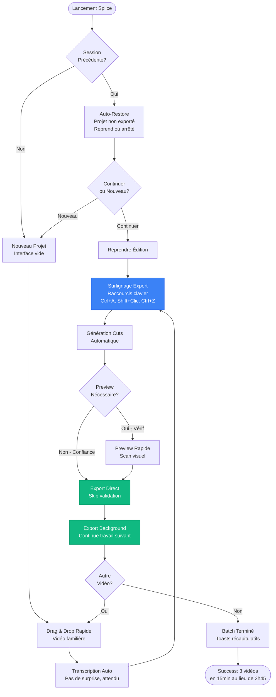

# User Journey Flows

## Journey 1: Orlan - Premier Usage & Découverte

**Objectif:** Transformer un monteur sceptique en utilisateur convaincu en moins de 5 minutes par démonstration de valeur irréfutable.

**Contexte:** Orlan teste Splice pour la première fois avec une interview de 1h30 (22GB). Il est habitué à Premiere Pro et sceptique sur les outils "magiques".

**Flow Détaillé:**

```mermaid
flowchart TD
    Start([Premier Lancement Splice]) --> Install{App Installée?}
    Install -->|Non| Download[Téléchargement + Installation<br/>2min]
    Install -->|Oui| Launch[Lancement App]
    Download --> Launch
    
    Launch --> Welcome[Écran Welcome<br/>Message: Drag & Drop vidéo]
    
    Welcome --> Import[Drag & Drop Vidéo<br/>Interview 1h30, 22GB]
    Import --> Validate{Format/Codec<br/>Supporté?}
    
    Validate -->|Non| ErrorFormat[Message Erreur<br/>Format non supporté<br/>MP4/MOV/AVI uniquement]
    ErrorFormat --> Import
    
    Validate -->|Oui| ProgressImport[Progress: Import<br/>Barre %, Temps estimé<br/>Annulation disponible]
    
    ProgressImport --> Transcribe[Transcription Auto<br/>Parakeet Local]
    Transcribe --> ProgressTranscribe[Progress: Transcription<br/>60min → 1-2s]
    
    ProgressTranscribe --> WowMoment[💡 WOW MOMENT<br/>Transcript Complet Affiché<br/>2 secondes!]
    
    WowMoment --> Interface[Interface Principale<br/>Transcript | Preview | Timeline]
    Interface --> Tooltip[Tooltip Subtil<br/>Surlignez passages à garder]
    
    Tooltip --> FirstHighlight[Premier Surlignage Texte]
    FirstHighlight --> SyncMagic[✨ Synchronisation Magique<br/>Timeline s'illumine instantanément<br/>Lien texte-vidéo évident]
    
    SyncMagic --> MassHighlight[Surlignage Massif<br/>3 minutes lecture + sélection<br/>80% du transcript]
    
    MassHighlight --> GenerateCuts[Clic: Générer les Cuts<br/>Bouton activé]
    GenerateCuts --> ProgressCuts[Progress: Génération Cuts<br/>10-30s pour 1h vidéo<br/>%, temps estimé]
    
    ProgressCuts --> PreviewReady[Preview Prête<br/>Notification success]
    PreviewReady --> PreviewPlay[Lecture Preview<br/>Cuts parfaits, transitions naturelles]
    
    PreviewPlay --> Validation{Cuts<br/>Satisfaisants?}
    
    Validation -->|Non| BackToHighlight[Retour Modification<br/>Ajuster sélections]
    BackToHighlight --> MassHighlight
    
    Validation -->|Oui| ReadyExport[Prêt à Exporter<br/>Bouton Export activé]
    ReadyExport --> Export[Clic: Exporter MP4]
    
    Export --> ProgressExport[Progress: Export<br/>Max 2x durée vidéo finale<br/>%, temps estimé]
    
    ProgressExport --> ExportComplete[Export Terminé<br/>Toast Success<br/>Fichier prêt Premiere/DaVinci]
    
    ExportComplete --> Realization[💡 RÉALISATION<br/>1h15 habituel → 4min45s réel<br/>1h10 gagnées sur UNE vidéo]
    
    Realization --> Success([Success: Adoption<br/>Orlan évangéliste])
    
    style WowMoment fill:#10b981,stroke:#059669,color:#fff
    style SyncMagic fill:#10b981,stroke:#059669,color:#fff
    style Realization fill:#10b981,stroke:#059669,color:#fff
    style ErrorFormat fill:#ef4444,stroke:#dc2626,color:#fff
```

**Points Critiques:**
1. **Wow Moment (Transcription 2s):** Première validation de la promesse de rapidité
2. **Synchronisation Magique:** Apprentissage du pattern novel sans tutorial
3. **Preview Parfaite:** Établissement de la confiance (cuts précis, pas de retouches)
4. **Réalisation Finale:** Calcul mental du temps gagné = motivation recommandation

**Error Recovery:**
- Format non supporté → Message clair + retry
- Transcription échoue → Retry automatique avec backoff
- Cuts imprécis → Retour modification sélections facile

## Journey 2: Workflow Utilisateur Répété (Routine Productive)

**Objectif:** Maximiser efficacité pour utilisateur expert avec workflow établi et confiance totale dans l'outil.

**Contexte:** Nicolas utilise Splice pour sa 30ème vidéo. Workflow maîtrisé, raccourcis clavier connus, confiance établie.

**Flow Optimisé:**



**Optimisations Productivité:**
1. **Auto-Restore:** Pas de perte travail, reprise immédiate
2. **Raccourcis Clavier:** Surlignage sans souris (Ctrl+A tout, Shift+Clic range, Ctrl+Z undo)
3. **Skip Preview:** Confiance établie = export direct (gain temps)
4. **Export Background:** Multitâche pendant export (traiter vidéo suivante)

**Power User Features:**
- Batch processing implicite (enchaîner vidéos)
- Raccourcis mémorisés (muscle memory)
- Workflow minimal (3 actions: Import → Highlight → Export)

## Journey 3: Sophie - Conversion Freemium (Preuve → Achat)

**Objectif:** Démontrer valeur complète AVANT blocage paiement pour conversion naturelle basée sur preuve irréfutable.

**Contexte:** Sophie découvre Splice via Twitter, sceptique, teste avec podcast gaming 1h15. Version gratuite limitée à 30min sources.

**Flow Conversion:**

```mermaid
flowchart TD
    Start([Découverte Splice<br/>Twitter/Bouche-à-oreille]) --> Download[Téléchargement App<br/>Version Freemium]
    
    Download --> Install[Installation<br/>2min]
    Install --> FirstLaunch[Premier Lancement]
    
    FirstLaunch --> Welcome[Welcome Screen<br/>Message: Gratuit ≤30min<br/>Pro = Export illimité]
    
    Welcome --> Import[Import Podcast<br/>1h15, 18GB]
    
    Import --> CheckDuration{Durée<br/>≤30min?}
    
    CheckDuration -->|Non >30min| WarningFreemium[⚠️ Warning Freemium<br/>Vidéo >30min<br/>Export bloqué<br/>Preview autorisée]
    CheckDuration -->|Oui ≤30min| NormalFlow[Flow Normal]
    
    WarningFreemium --> AcceptContinue{Continuer<br/>Quand Même?}
    AcceptContinue -->|Non| Import
    AcceptContinue -->|Oui| Transcribe[Transcription<br/>Complète autorisée]
    
    NormalFlow --> Transcribe
    
    Transcribe --> WowSpeed[💡 Wow: Vitesse<br/>1h15 → 2s]
    
    WowSpeed --> Highlight[Surlignage Passages<br/>5 minutes lecture]
    
    Highlight --> Generate[Génération Cuts<br/>18s traitement]
    
    Generate --> PreviewPerfect[✨ Preview Parfaite<br/>Cuts précis<br/>Transitions naturelles<br/>Valeur PROUVÉE]
    
    PreviewPerfect --> MentalCalc[🧮 Calcul Mental<br/>1h15 habituel → 6min réel<br/>1h09 gagnée<br/>€40/h taux = €46 valeur]
    
    MentalCalc --> AttemptExport[Clic: Exporter]
    
    AttemptExport --> BlockExport[🔒 BLOCAGE EXPORT<br/>Modal Conversion]
    
    BlockExport --> ConversionModal[Message:<br/>Vous avez créé votre vidéo en 6min<br/>Normalement: 1h15<br/>Débloquez export: €15/mois<br/>Bouton: Upgrade to Pro]
    
    ConversionModal --> Decision{Décision<br/>Payer?}
    
    Decision -->|Non| Frustration[Frustration<br/>Vidéo parfaite non exportable]
    Frustration --> Reconsider{Reconsidérer?}
    Reconsider -->|Oui| Decision
    Reconsider -->|Non| Abandon([Abandon<br/>Perte potentielle])
    
    Decision -->|Oui| Payment[Payment Stripe<br/>Souscription €15/mois]
    
    Payment --> Upgrade[Upgrade Account<br/>Pro activé]
    
    Upgrade --> UnlockExport[Export Débloqué<br/>Toast Success]
    
    UnlockExport --> Export[Export MP4<br/>Terminé]
    
    Export --> Satisfaction[😊 Satisfaction<br/>Valeur reçue > Prix payé]
    
    Satisfaction --> Tweet[Tweet Recommandation<br/>Évangélisation organique]
    
    Tweet --> Success([Success: Conversion<br/>+ Advocacy])
    
    style WowSpeed fill:#10b981,stroke:#059669,color:#fff
    style PreviewPerfect fill:#10b981,stroke:#059669,color:#fff
    style BlockExport fill:#f59e0b,stroke:#d97706,color:#000
    style ConversionModal fill:#f59e0b,stroke:#d97706,color:#000
    style Satisfaction fill:#10b981,stroke:#059669,color:#fff
    style Abandon fill:#ef4444,stroke:#dc2626,color:#fff
```



**Points Critiques de Conversion:**

1. **Warning Précoce:** Utilisateur informé dès import >30min (transparence)
2. **Preview Autorisée:** Freemium voit la vidéo parfaite (preuve valeur)
3. **Blocage Stratégique:** Export verrouillé APRÈS preview = frustration calculée + valeur prouvée
4. **Message Conversion:** Temps gagné explicite (1h15 → 6min) + prix justifié (€15/mois vs €46 valeur)
5. **Friction Positive:** Frustration motive achat (vidéo parfaite inaccessible)

**Conversion Psychology:**
- Utilisateur a investi 6min (sunk cost)
- Vidéo parfaite visible (preuve tangible)
- Calcul mental ROI immédiat (€15 vs 1h09 gagnée)
- Alternative = retour workflow manuel 1h15 (inacceptable après avoir vu mieux)

## Journey Patterns Communs

**Pattern 1: Feedback Transparent Progressif**

Appliqué à: Toutes opérations longues (import, transcription, cuts, export)

**Composants:**
- Barre de progression visuelle (0-100%)
- Pourcentage textuel précis
- Estimation temps restant honnête (pas optimiste)
- Bouton annulation toujours visible
- Message status clair ("Transcription en cours...", "Génération des cuts...")

**Rationale:** Réduit anxiété, établit confiance par transparence, donne contrôle (annulation)

**Pattern 2: Apprentissage par Affordance Visuelle**

Appliqué à: Synchronisation texte-timeline (pattern novel)

**Composants:**
- Tooltip discret au premier lancement uniquement
- Feedback immédiat action utilisateur (surlignage → timeline update <16ms)
- Animation subtile renforce lien mental (pulse, highlight)
- Disparition automatique tooltip après première interaction

**Rationale:** Pattern novel appris intuitivement sans tutorial, pas de friction apprentissage

**Pattern 3: Validation Avant Commitment**

Appliqué à: Preview avant export, confirmation actions critiques

**Composants:**
- Preview obligatoire première fois (établit confiance)
- Preview optionnelle utilisateurs experts (efficacité)
- Bouton export désactivé jusqu'à preview validée (première fois)
- Confirmation modal actions destructives (supprimer projet, etc.)

**Rationale:** Évite erreurs coûteuses, établit confiance qualité résultat

**Pattern 4: Auto-Save Silencieux**

Appliqué à: Sauvegarde projet, sélections, état interface

**Composants:**
- Auto-save toutes les 30s sans interruption workflow
- Pas de modal "Voulez-vous sauvegarder?" jamais
- Crash recovery automatique au redémarrage
- Indicateur discret "Sauvegarde..." (icône header, 1s)

**Rationale:** Zéro perte travail, zéro friction cognitive, workflow continu

**Pattern 5: Conversion par Preuve Irréfutable**

Appliqué à: Freemium → Pro upgrade

**Composants:**
- Utilisateur voit/touche/valide résultat complet AVANT blocage
- Message conversion = temps gagné explicite + prix justifié
- Blocage arrive après investissement temps utilisateur (sunk cost)
- Alternative (retour manuel) rendue inacceptable par comparaison

**Rationale:** Conversion naturelle car valeur déjà prouvée, frustration calculée motive achat

## Flow Optimization Principles

**Principe 1: Minimiser Steps to Value**

**Application:**
- Import → Wow (transcription 2s) = 2 steps
- Wow → Résultat utilisable (preview) = 2 steps (highlight + generate)
- Total steps to value = 4 actions seulement

**Mesure Success:** Utilisateur voit valeur en <5min première utilisation

**Principe 2: Progressive Disclosure Intelligence**

**Application:**
- Première utilisation: Tooltip subtil apprentissage pattern
- Utilisation établie: Interface minimale, zéro distraction
- Features avancées: Accessibles mais pas imposées (ajustements frame-by-frame disponibles, pas obligatoires)

**Mesure Success:** Interface s'adapte à l'expertise utilisateur sans configuration manuelle

**Principe 3: Feedback Proportionnel à l'Anxiété**

**Application:**
- Opérations rapides (<2s): Pas de feedback (instantané perçu)
- Opérations moyennes (2-10s): Progress bar simple
- Opérations longues (10s+): Progress bar + % + temps estimé + annulation
- Gros fichiers (15-50GB): Feedback détaillé dès import (réassurance)

**Mesure Success:** Utilisateur ne se demande jamais "est-ce que ça a planté?"

**Principe 4: Error Recovery Sans Pénalité**

**Application:**
- Erreurs techniques (transcription rate): Retry automatique avec backoff, message clair
- Erreurs utilisateur (cuts imprécis): Retour modification facile, zéro pénalité temps
- Annulation opération: Annulation immédiate, retour état précédent clean

**Mesure Success:** Aucune erreur ne force restart complet du workflow

**Principe 5: Moments de Delight Stratégiques**

**Application:**
- Wow #1: Transcription 2s (surprise vitesse)
- Wow #2: Synchronisation texte-timeline (magie visuelle)
- Wow #3: Preview parfaite (confiance qualité)
- Wow #4: Réalisation temps gagné (accomplissement disproportionné)

**Mesure Success:** Utilisateur raconte spontanément ces moments à collègues
